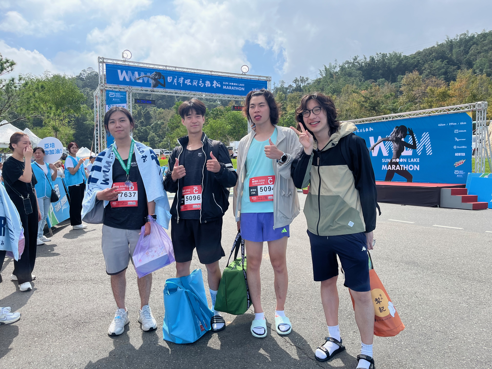

import GPXViewer from '../../src/components/ElevationDistanceChart';

<!-- truncate -->

## Introduction
Sun Moon Lake is located in Nantou, in the central part of Taiwan. It is the largest lake in Taiwan. It serves as a reservoir and generates electricity to provide local people with water and power. The scenery is very beautiful, and many tourists come here and stay in hotels. Additionally, Taiwanese black tea from this area is also famous. The tea eggs are very delicious—if you have an opportunity, you must come and try one!

## Route
<GPXViewer src="/summoonlake.gpx" />

## Marathon
Today, I had to run 27 km. This was my first time running more than 21 km. In addition, the changes in altitude made it even more challenging and tested my running ability.
If I ran too fast at the beginning, the last part would feel like a nightmare. On the other hand, if I ran too slowly, I might not finish the marathon. So it was difficult to decide what pace I should run.
At the beginning of the race, because I wanted to get a good finishing time, I ran faster than usual. I regretted this after 21 km—my feet and legs cramped, and I could hardly run anymore. I had to slow down and start walking.
“I felt like I didn’t have much chance to finish the marathon.” I looked at the steep road ahead, feeling depressed and frustrated, but I still didn’t give up.
Finally, I finished! When I saw the finish line, it felt like seeing an oasis. It was an unforgettable experience. The scenery was truly gorgeous. I highly recommend everyone try this marathon!