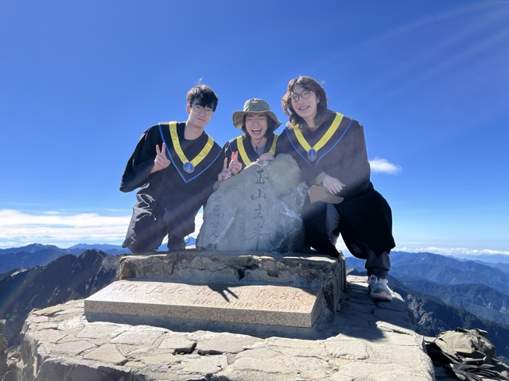

{/* truncate */}
This weekend, I went hiking on Yushan with my university classmates. During the two-day, one-night journey, I will never forget the breathtaking view from the summit of Yushan Main Peak.

On Saturday afternoon, we rented a car together and drove to the mountain hut where we were to stay for the first night. Along the way, we stopped at convenience stores to buy food and supplies for the two days. The journey was filled with laughter as we drove while listening to music and enjoying the beautiful sunset scenery. By the time we arrived at our destination, it was already evening. We gathered in the mountain hut to enjoy the dinner we had bought earlier. After the meal, we decided to go out for a walk.

The moment we opened the door, a gust of cold wind rushed towards us. Out of curiosity, we ventured a short distance despite the chill. Just as we were about to head back to the hut, one of my friends exclaimed, “Look up!” That’s when I noticed the sky filled with countless stars, a sight I had never seen before. I was so excited that I hurried to capture the scene with my phone. It felt like the stars were blessing us for a successful climb the next day!

The following day, we woke up at 3 a.m., changed into our gear, and began our summit attempt. At that time, it was still dark, and we relied on our headlamps to illuminate the path. Along the way, we spotted some of Taiwan’s endemic species, which we assumed were Formosan muntjacs. Although we weren’t entirely sure, it was both surprising and delightful to see them. As the sun gradually rose, it illuminated the entire valley.

We were fortunate to have perfect weather that day—no wind, no rain—which felt like a gift from above. As we ascended, the vegetation around us gradually transitioned from broadleaf forests to coniferous trees. We speculated that these might be Taiwan firs or Taiwan cypresses.

Throughout the hike, we were mindful of our timing. After persistent effort, we reached the summit around 11 a.m.! The final stretch was nothing short of grueling. The steep, zigzagging trail, combined with the thin air, made every step feel like a challenge. At times, we had to use our hands to climb. I am truly grateful for the excellent weather that day; if it had been windy or rainy, we likely wouldn’t have made it.

Standing on the main peak of Yushan brought an indescribable sense of emotion. This was my first climb of one of Taiwan’s Hundred Peaks, and I am determined to continue conquering Taiwan’s mountains with my own two feet!