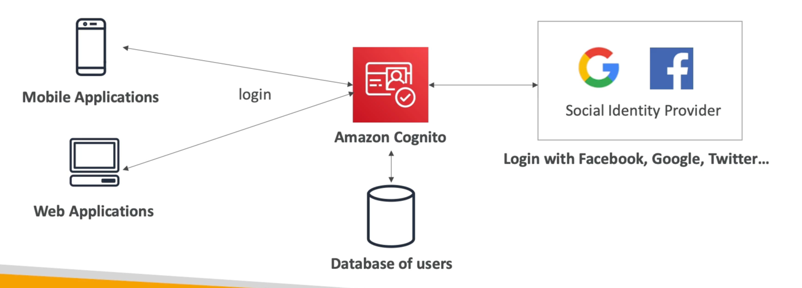

# Cognito

- Give users an identity to interact with our web or mobile application
- Cognito User Pools:
    - Sign in functionality for app users
    - Integrate with API Gateway & Application Load Balancer
- Cognito Identity Pools (Federated Identity):
    - Provide AWS credentials to users so they can access AWS resources directly
    - Integrate with Cognito User Pools as an identity provider
- Cognito vs IAM: “hundreds of users”, ”mobile users”, “authenticate with SAML”

## Cognito User Pools (CUP) – User Features
- Create a serverless database of user for your web & mobile apps
- Simple login: Username (or email) / password combination
- Password reset
- Email & Phone Number Verification
- Multi-factor authentication (MFA)
- Federated Identities: users from Facebook, Google, SAML...

## Cognito User Pools (CUP) – Integration
- CUP integrates with API Gateway and Application Load Balancer

## Cognito Identity Pools (Federated Identities)
- Get identities for “users” so they obtain temporary AWS credentials
- Users source can be Cognito User Pools, 3rd party logins, etc…
- Users can then access AWS services directly or through API Gateway
- The IAM policies applied to the credentials are defined in Cognito
- They can be customized based on the user_id for fine grained control
- Default IAM roles for authenticated and guest users
###  Diagram

## Cognito Identity Pools Row Level Security in DynamoDB
