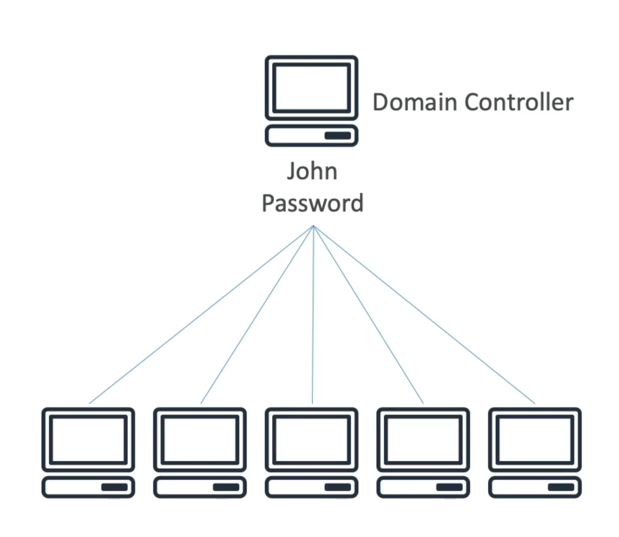

# Microsoft Active Directory (AD)

- Found on any Windows Server with AD Domain Services 
- Database of objects: User Accounts, Computers, Printers, File Shares, Security Groups
- Centralized security management, create account, assign permissions

# AWS Directory Service
## AWS Managed Microsoft AD
- Create your own AD in AWS, manage users locally, supports MFA
- Establish "trust" connections with your on-premise AD
## AD Connector
- Directory Gateway(Proxy) to redirect requests to on-premise AD
- Users are managed on the on-premise AD
## Simple AD
- AD-compatible managed directory on AWS
- Cannot be joined with on-premise AD