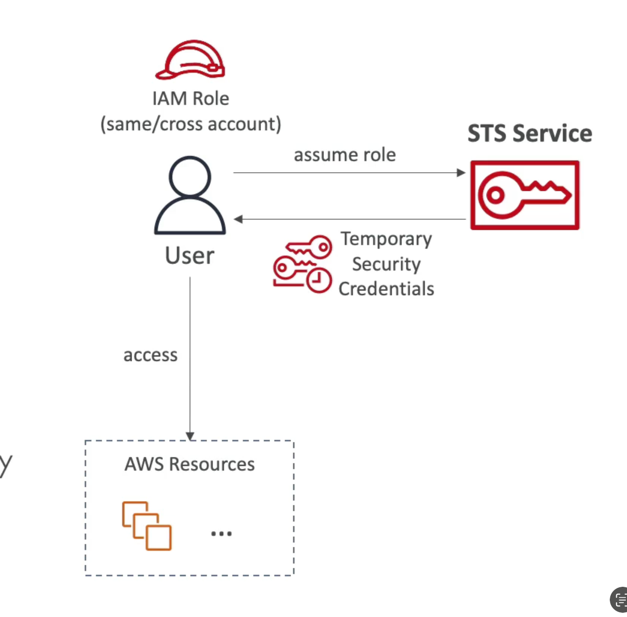

# STS(Security Token Service)

- Enables you to create temporary, limited-privileges credentials to access your AWS resources
- Short-term credentials: you configure expiration period
- Use cases
- Identity federation: manage user identities in external systems, and provide them with STS tokens to access AWS resources
- IAM Roles for cross/same account access
- IAM Roles for Amazon EC2: provide temporary credentials for EC2 instances to access AWS resources