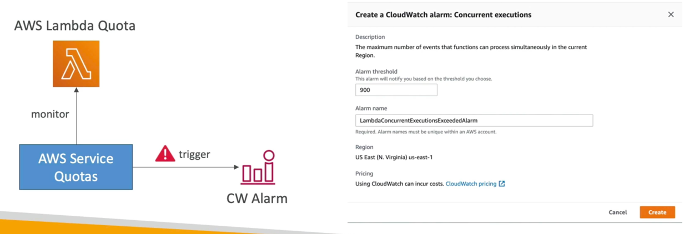

# Service Quota
- Notify you when you're close to a service quota value threshold
- Create Cloud Watch Alarms on the Service Quotas console
- Example: Lambda concurrent executions
- Request a quota increase from AWS Service Quotas or shutdown resources before limit is reached
