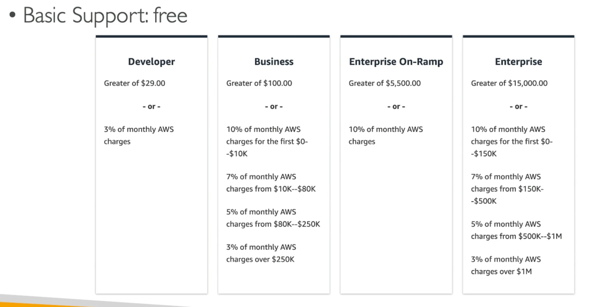

# AWS Support Plan

## Basic Support
- Customer Service & Communities - 24x7 access to customer service, documentation, whitepapers, and support forums.
- AWS Trusted Advisor - Access to the 7 core Trusted Advisor checks and guidance to provision your resources following best practices to increase performance and improve security.
- AWS Personal Health Dashboard - A personalized view of the health of AWS services, and alerts when your resources are impacted.

## Developer Support
- All Basic Support Plan +
- Business hours email access to Cloud Support Associates
- Unlimited cases / unlimited contacts
- Case severity / response times:
- General guidance: < 24 business hours
- System impaired: < 12 business hours

## Business Support (24x7)
- Intended to be used if you have production workloads
- Trusted Advisor - Full set of checks + API access
- 24x7 phone, email, and chat access to Cloud Support Engineers
- Unlimited cases / unlimited contacts
- Access to Infrastructure Event Management for additional fee.
- Case severity / response times:
- General guidance: < 24 business hours
- System impaired: < 12 business hours
- Production system impaired: < 4 hours
- Production system down: < 1 hour

## Enterprise On-Ramp Support (24x7)
- Intended to be used if you have production or business critical workloads
- All of Business Support Plan +
- Access to a pool of Technical Account Managers (TAM)
- Concierge Support Team (for billing and account best practices)
- Infrastructure Event Management, Well-Architected & Operations Reviews
- Case severity / response times:
-
- Production system impaired: < 4 hours
- Production system down: < 1 hour
- Business-critical system down: < 30 minutes

## Enterprise Support (24x7)
- Intended to be used if you have mission critical workloads
- All of Business Support Plan +
- Access to a designated Technical Account Manager (TAM)
- Concierge Support Team (for billing and account best practices)
- Infrastructure Event Management, Well-Architected & Operations Reviews
- Access to AWS Incident Detection and Response (for an additional fee)
- Case severity / response times:
- ...
- Production system impaired: < 4 hours
- Production system down: < I hour
- Business-critical system down: < 15 minutes