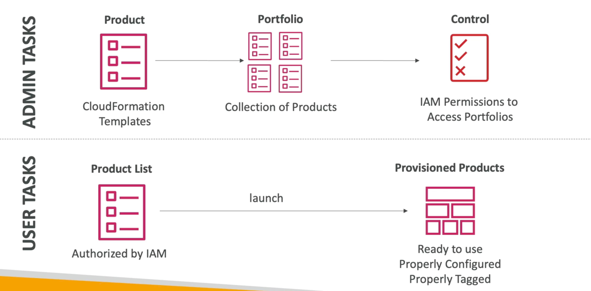

# Catalog

- Users that are new to AWS have too many options, and may create stacks that are not compliant / in line with the rest of the organization
- Some users just want a quick self-service portal to launch a set of authorized products pre-defined by admins
- Includes: virtual machines, databases, storage options, etc...
- Enter AWS Service Catalog!