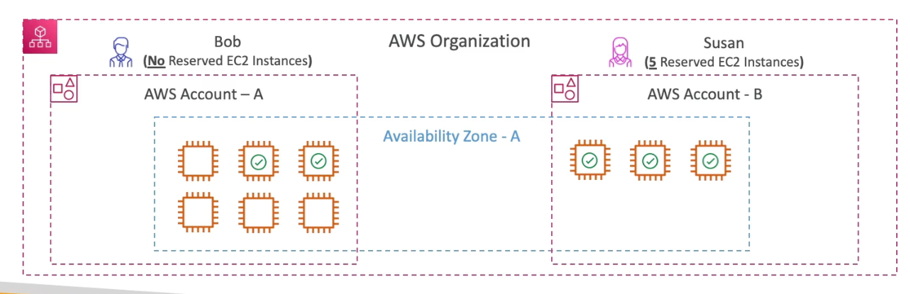

# Consolidated Billing

- When enabled, provides you with:
    - Combined Usage - combine the usage across all AWS accounts in the AWS Organization to share the volume pricing, Reserved Instances and Savings Plans discounts
    - One Bill - get one bill for all AWS Accounts in the AWS Organization
- lhe management account can turn oft Keserved Instances discount sharing for any account in the AWS Organization, including itself