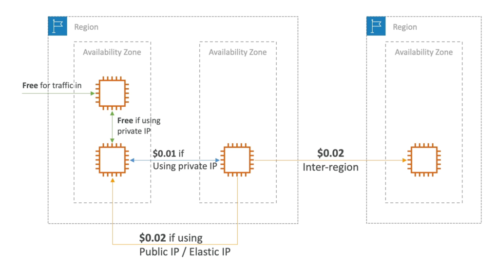

# Pricing Model
- AWS has 4 pricing models:
- Pay as you go: pay for what you use, remain agile, responsive, meet scale demands
- Save when you reserve: minimize risks, predictably manage budgets, comply with long-terms requirements
    - Reservations are available for EC2 Reserved Instances, DynamoDB Reserved Capacity, ElastiCache Reserved Nodes, RDS Reserved Instance, Redshift Reserved Nodes
- Pay less by using more: volume-based discounts
- Pay less as AWS grows

# EC2 Pricing
- Only charged for what you use
- Number of instances
- Instance configuration:
    - Physical capacity
    - Region
    - OS and software
    - Instance type
    - Instance size
- ELB running time and amount of data processed
- Detailed monitoring

## On-demand instances:
- Minimum of 60s
- Pay per second (Linux/Windows) or per hour (other)
## Reserved instances:
- Up to 75% discount compared to On-demand on hourly rate
- 1- or 3-years commitment
- All upfront, partial upfront, no upfront
## Spot instances:
- Up to 90% discount compared to On-demand on hourly rate
- Bid for unused capacity
## Dedicated Host:
- On-demand
- Reservation for 1 year or 3 years commitment
## Savings plans as an alternative to save on sustained usage

# Lambda Pricing
- Pay per call
- Pay per duration

# ECS Pricing
- EC2 Launch Type Model: No additional fees, you pay for AWS resources stored and created in your application

# Fargate Pricing
- Fargate Launch Type Model: Pay for vCPU and memory resources allocated to your applications in your containers

# S3 Pricing
- Storage class: S3 Standard, S3 Infrequent Access, S3 One-Zone IA, S3 Intelligent Tiering, S3 Glacier and S3 Glacier Deep Archive
- Number and size of objects: Price can be tiered (based on volume)
- Number and type of requests
- Data transfer OUT of the S3 region
- S3 Transfer Acceleration
- Lifecycle transitions
- Similar service: EFS (pay per use, has infrequent access & lifecycle rules)

# EBS Pricing
- Volume type (based on performance)
- Storage volume in GB per month provisionned
- IOPS:
    - General Purpose SSD: Included
    - Provisioned IOPS SSD: Provisionned amount in IOPS
    - Magnetic: Number of requests
- Snapshots:
    - Added data cost per GB per month
- Data transfer:
    - Outbound data transfer are tiered for volume discounts
    - Inbound is free

# RDS Pricing
- Per hour billing
- Database characteristics:
- Engine
- Size
- Memory class
- Purchase type:
- On-demand
- Reserved instances (1 or 3 years) with required up-front
- Backup Storage:There is no additional charge for backup storage up to 100% of your total database storage for a region.
- Additional storage (per GB per month)
- Number of input and output requests per month
- Deployment type (storage and 1/O are variable):
    - Single AZ
    - Multiple AZs
- Data transfer:
    - Outbound data transfer are tiered for volume discounts
    - Inbound is free

# CloudFront Pricing
- Pricing is different across different geographic regions
- Aggregated for each edge location, then applied to your bill
- Data Transfer Out (volume discount)
- Number of HTTP/HTTPS requests

# Networking Costs per GB - Simplified

- Use Private IP instead of Public IP for good savings and better network performance
- Use same AZ for maximum savings (at the cost of high availability)

# Billing and Costing Tools
- Estimating costs in the cloud:
    - Pricing Calculator
- Tracking costs in the cloud:
    - Billing Dashboard
    - Cost Allocation Tags
    - Cost and Usage Reports
    - Cost Explorer
- Monitoring against costs plans:
    - Billing Alarms
    - Budgets

# Cost and Usage Reports
- Dive deeper into your AWS costs and usage
- The AWS Cost & Usage Report contains the most comprehensive set of AWS cost and usage data available, including additional metadata about AWS services, pricing, and reservations (e.g., Amazon EC2 Reserved Instances (RIs)).
- The AWS Cost & Usage Report lists AWS usage for each service category used by an account and its IAM users in hourly or daily line items, as well as any tags that you have activated for cost allocation purposes.
- Can be integrated with Athena, Redshift or QuickSight

# Cost Explorer
- Visualize, understand, and manage your AWS costs and usage over time
- Create custom reports that analyze cost and usage data.
- Analyze your data at a high level: total costs and usage across all accounts
- Or Monthly, hourly, resource level granularity
- Choose an optimal Savings Plan (to lower prices on your bill)
- Forecast usage up to 12 months based on previous usage