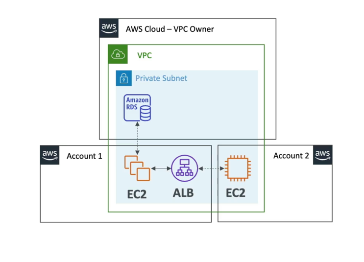

# RAM(Resource Access Manager)

- Share AWS resources that you own with other AWS accounts
- Share with any account or within your Organization
- Avoid resource duplication!
- Supported resources include Aurora, VPC Subnets, Transit Gateway, Route 53, EC2 Dedicated Hosts, License Manager Configurations...