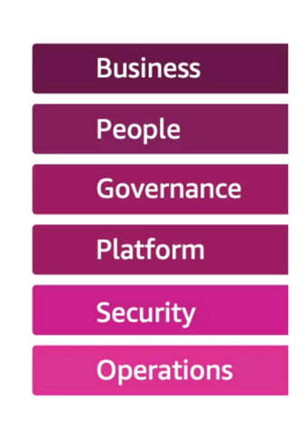

# Cloud Adoption Framework

- Helps you build and then execute a comprehensive plan for your digital transformation through innovative use of AWS
- Created by AWS Professionals by taking advantage of
AWS Best Practices and lessons learned from 1000s of customers
- AWS CAF identifies specific organizational capabilities that underpin successful cloud transformations
- AWS CAF groups its capabilities in six perspectives:
Business, People, Governance, Platform, Security, and Operations
# CAF Perspectives
## Business Perspective 
- helps ensure that your cloud investments accelerate your digital transformation ambitions and business outcomes.
## People Perspective 
- serves as a bridge between technology and business, accelerating the cloud journey to help organizations more rapidly evolve to a culture of continuous growth, learning, and where change becomes business-as-normal, with focus on culture, organizational structure, leadership, and workforce.
## Governance Perspective 
- helps you orchestrate your cloud initiatives while maximizing organizational benefits and minimizing transformation-related risks.
## Platform Perspective 
- helps you build an enterprise-grade, scalable, hybrid cloud platform; modernize existing workloads; and implement new cloud-native solutions.
## Security Perspective 
- helps you achieve the confidentiality, integrity, and availability of your data and cloud workloads.
## Operations Perspective
- helps ensure that your cloud services are delivered at a level that meets the needs of your business.

# Capabilities

- Platform Perspective helps you build an enterprise-grade, scalable, hybrid cloud platform; modernize existing workloads; and implement new cloud-native solutions.
- Security Perspective helps you achieve the confidentiality, integrity, and availability of your data and cloud workloads.
- Operations Perspective helps ensure that your cloud services are delivered at a level that meets the needs of your business.

# Cloud Transformation Value Chain

# Transformation Domain
- Technology - using the cloud to migrate and modernize legacy infrastructure, applications, data and analytics platforms...
- Process - digitizing, automating, and optimizing your business operations
- leveraging new data and analytics platforms to create actionable insights
- using machine learning (ML) to improve your customer service experience...
- Organization - Reimagining your operating model
- Organizing your teams around products and value streams
- Leveraging agile methods to rapidly iterate and evolve
- Product - reimagining your business model by creating new value propositions (products & services) and revenue models

# Transformation Phases
- Envision - demonstrate how the Cloud will accelerate business outcomes by identifying transformation opportunities and create a foundation for your digital transformation
- Align - identify capability gaps across the 6 AWS CAF Perspectives which results in an Action Plan
- Launch - build and deliver pilot initiatives in production and demonstrate incremental business value
- Scale - expand pilot initiatives to the desired scale while realizing the desired business benefits