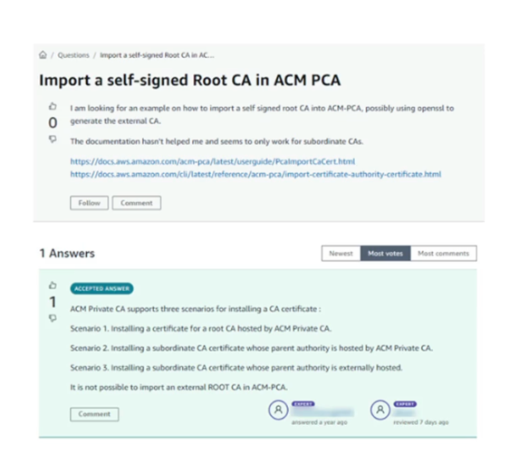

# Re:Post

- just like stackoverflow, but for AWS
• AWS-managed Q&A service offering crowd-sourced, expert-reviewed answers to your technical questions about AWS that replaces the original AWS Forums
• Part of the AWS Free Tier
• Community members can earn reputation points to build up their community expert status by providing accepted answers and reviewing answers from other users
• Questions from AWS Premium Support customers that do not receive a response from the community are passed on to AWS Support engineers
• AWS re:Post is not intended to be used for questions that are time-sensitive or involve any proprietary information