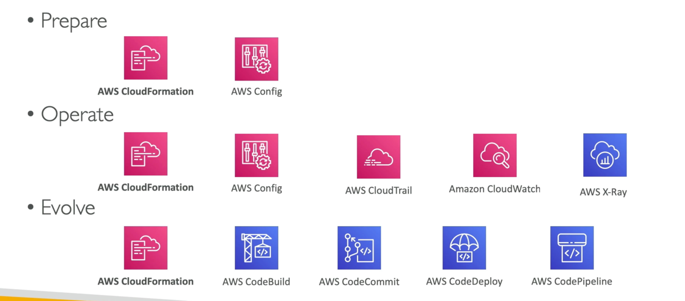
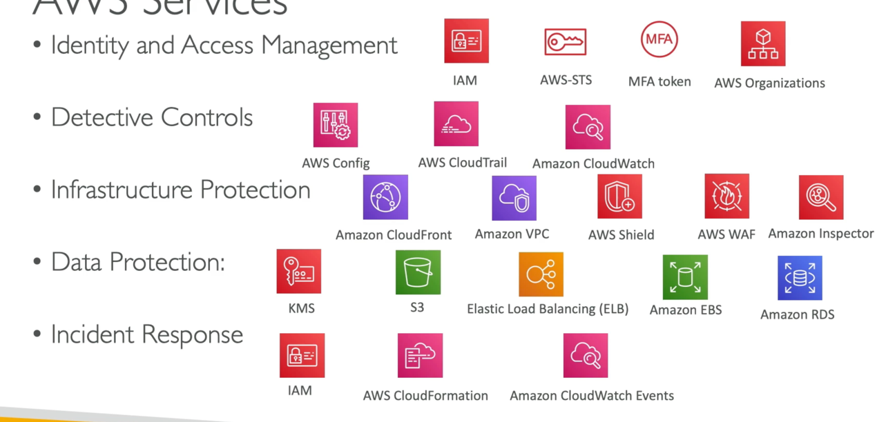
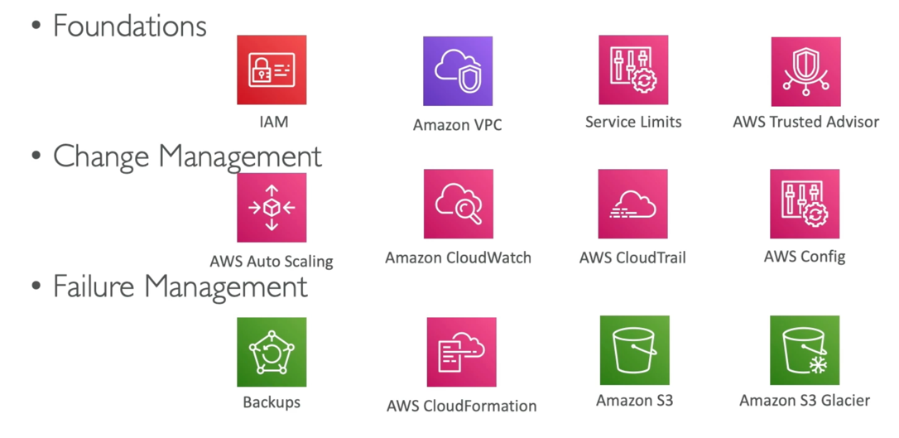
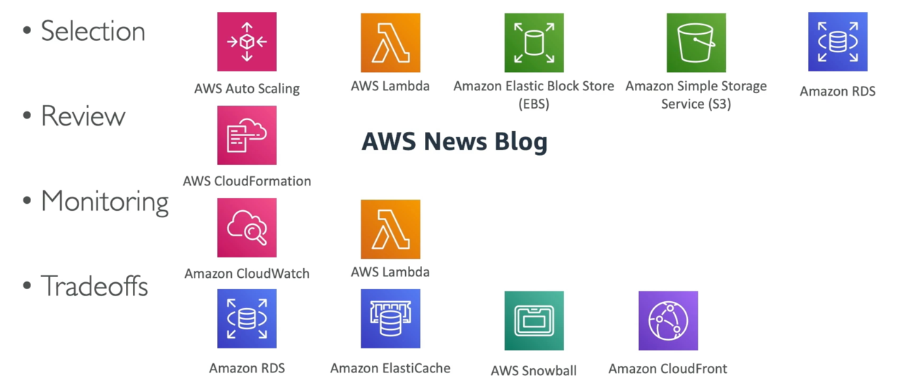
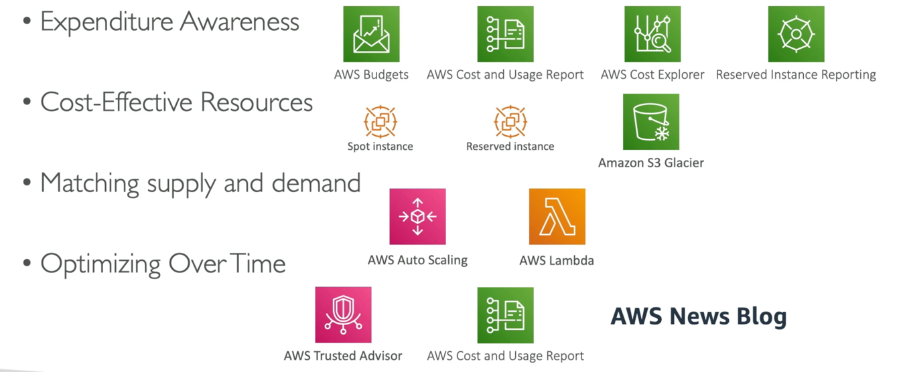
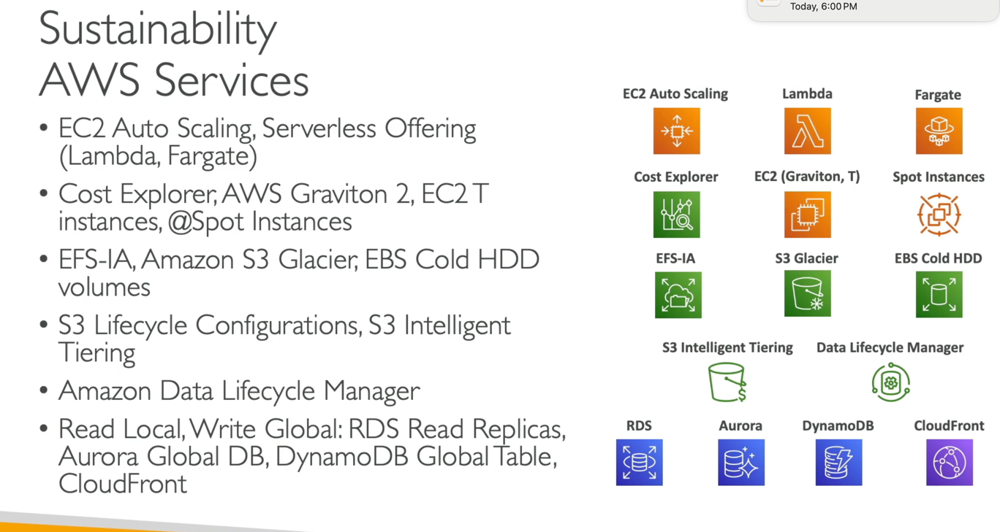

# Well Architecture Framework General Guide Principles
- Stop guessing your capacity needs
- Test systems at production scale
- Automate to make architectural experimentation easier
- Allow for evolutionary architectures
- Design based on changing requirements
    - Drive architectures using data
- Improve through game days
-    Simulate applications for flash sale days

# Cloud Best Practices - Design Principles
- Scalability: vertical & horizontal
- Disposable Resources: servers should be disposable & easily configured
- Automation: Serverless, Infrastructure as a Service, Auto Scaling...
- Loose Coupling:
    - Monolith are applications that do more and more over time, become bigger
    - Break it down into smaller, loosely coupled components
    - A change or a failure in one component should not cascade to other components
- Services, not Servers:
    - Don't use just EC2
    - Use managed services, databases, serverless, etc !

# AWS Well-Architected Framework 6 Pillars
1) Operational Excellence

   - Includes the ability to run and monitor systems to deliver business value and to continually improve supporting processes and procedures
   - Design Principles
       - Perform operations as code - Infrastructure as code
       - Make frequent, small, reversible changes - So that in case of any failure, you can reverse it
       - Refine operations procedures frequently - And ensure that team members are familiar with it
       - Anticipate failure
       - Learn from all operational failures
       - Use managed services - to reduce operational burden
       - Implement observability for actionable insights - performance, reliability, cost...
2) Security

   - Includes the ability to protect information, systems, and assets while delivering business value through risk assessments and mitigation strategies
   - Design Principles
   - Implement a strong identity toundation - Centralize privilege management and reduce (or ever eliminate) reliance on long-term credentials - Principle of least privilege - IAM
   - Enable traceability - Integrate logs and metrics with systems to automatically respond and take action
   - Apply security at all layers - Like edge network, VPC, subnet, load balancer, every instance operating system, and applicatior
   - Automate security best practices
   - Protect data in transit and at rest - Encryption, tokenization, and access control
   - Keep people away from data - Reduce or eliminate the need for direct access or manual processing of data
   - Prepare for security events - Run incident response simulations and use tools with automation to increase your speed for detection, investigation, and recovery
3) Reliability

   - Ability of a system to recover from infrastructure or service disruptions, dynamically acquire computing resources to meet demand , and mitigate disruptions such as misconfigurations or transient network issues
   - Design Principles
   - Test recovery procedures - Use automation to simulate different failures or to recreate scenarios that led to failures before
   - Automatically recover from failure - Anticipate and remediate failures before they occur
   - Scale horizontally to increase aggregate system availability - Distribute requests across multiple, smaller resources to ensure that they don't share a common point of failure
   - Stop guessing capacity - Maintain the optimal level to satisfy demand without over or under provisioning - Use Auto Scaling
   - Manage change in automation - Use automation to make changes to infrastructure
4) Performance Efficiency

   - Includes the ability to use computing resources efficiently to meet system requirements, and to maintain that efficiency as demand changes and technologies evolve
   - Design Principles
   - Democratize advanced technologies - Advance technologies become services and hence you can focus more on product development
   - Go global in minutes - Easy deployment in multiple regions
   - Use serverless architectures - Avoid burden of managing servers
   - Experiment more often - Easy to carry out comparative testing
   - Mechanical sympathy - Be aware of all AWS services
5) Cost Optimization

   - Includes the ability to run systems to deliver business value at the lowest price point
   - Design Principles
   - Adopt a consumption mode - Pay only for what you use
   - Measure overall efficiency - Use Cloud Watch
   - Stop spending money on data center operations - AWS does the infrastructure part and enables customer to focus on organization projects
   - Analyze and attribute expenditure - Accurate identification of system usage and costs, helps measure return on investment (ROl) - Make sure to use tags
   - Use managed and application level services to reduce cost of ownership - As managed services operate at cloud scale, they can offer a lower cost per transaction or service
6) Sustainability

   - The sustainability pillar focuses on minimizing the environmental impacts of running cloud workloads.
   - Design Principles
   - Understand your impact - establish performance indicators, evaluate improvements
   - Establish sustainability goals - Set long-term goals for each workload, model return on investment (ROI)
   - Maximize utilization - Right size each workload to maximize the energy efficiency of the underlying hardware and minimize idle resources.
   - Anticipate and adopt new and more efficient hardware and software offerings - and design to flexibly adopt new technologies over time
   - Use managed services - Shared services reduce the amount of infrastructure; Managed services o automate sustainability best practices as moving infrequent accessed data to cold storage
   and adjusting compute capacity
   - Reduce the downstream impact of your cloud workloads - Reduce the amount of energy or resources required to use your services and reduce the need for your customers to upgrade their devices
- They are not something to balance, or trade-offs, they're a synergy