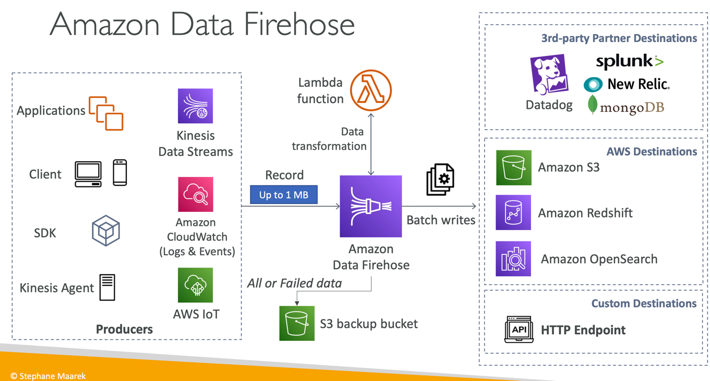

# Data Firehose

- Note: used to be called “Kinesis Data Firehose”
- Fully Managed Service
    - Amazon Redshift / Amazon S3 / Amazon OpenSearch Service
    - 3rd party: Splunk / MongoDB / Datadog / NewRelic / …
    - Custom HTTP Endpoint
- Automatic scaling, serverless, pay for what you use
- Near Real-Time with buffering capability based on size / time
- Supports CSV, JSON, Parquet, Avro, Raw Text, Binary data
- Conversions to Parquet / ORC, compressions with gzip / snappy
- Custom data transformations using AWS Lambda (ex: CSV to JSON)

## Kinesis Data Firehose vs Kinesis Data Streams
### Kinesis Data Streams
- Streaming data collection
- Producer & Consumer code
- Real-time
- Provisioned / On-Demand mode
- Data storage up to 365 days
- Replay Capability

### Kinesis Data Firehose
- Load streaming data into S3 / Redshift / OpenSearch / 3rd party / custom HTTP
- Fully managed
- Near real-time
- Automatic scaling
- No data storage
- Doesn’t support replay capability

