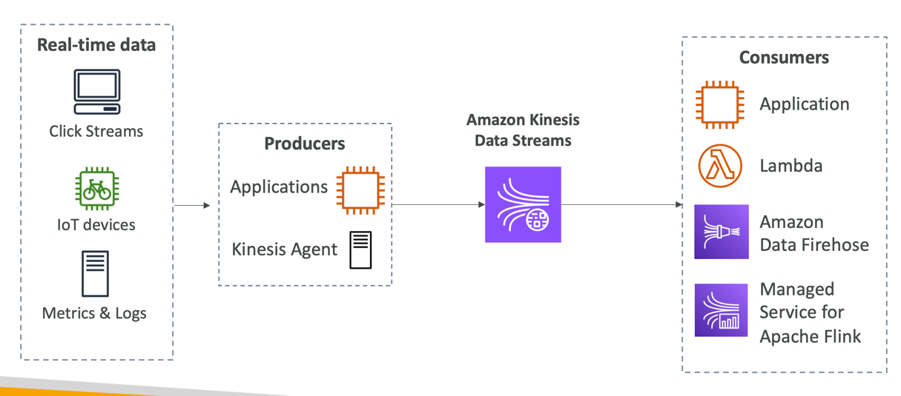

# Kinesis Data Streams
- For the exam: Kinesis = real-time big data streaming
- Managed service to collect, process, and analyze real-time streaming data at any scale
- Too detailed for the Cloud Practitioner exam but good to know:
- Amazon Kinesis Data Streams: low latency streaming to ingest data at scale from hundreds of thousands of sources
- Amazon Data Firehose: load Kinesis Data Streams into Amazon S3, Redshift, OpenSearch, etc...

- Retention between up to 365 days
- Ability to reprocess (replay) data by consumers
- Data can’t be deleted from Kinesis (until it expires)
- Data up to 1MB (typical use case is lot of “small” real-time data)
- Data ordering guarantee for data with the same “Partition ID”
- At-rest KMS encryption, in-flight HTTPS encryption
- Kinesis Producer Library (KPL) to write an optimized producer application
- Kinesis Client Library (KCL) to write an optimized consumer application

## Capacity Modes
- Provisioned mode:
- Choose number of shards
- Each shard gets 1MB/s in (or 1000 records per second)
- Each shard gets 2MB/s out
- Scale manually to increase or decrease the number of shards
- You pay per shard provisioned per hour
- On-demand mode:
- No need to provision or manage the capacity
- Default capacity provisioned (4 MB/s in or 4000 records per second)
- Scales automatically based on observed throughput peak during the last 30 days
- Pay per stream per hour & data in/out per GB

