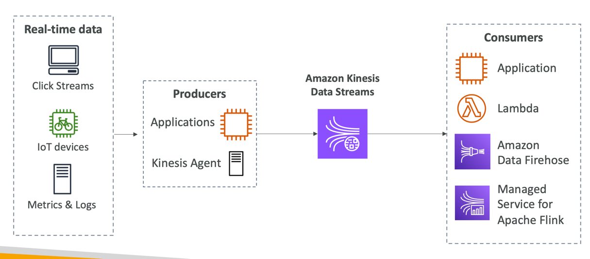

- For the exam: Kinesis = real-time big data streaming
- Managed service to collect, process, and analyze real-time streaming data at any scale
- Too detailed for the Cloud Practitioner exam but good to know:
- Amazon Kinesis Data Streams: low latency streaming to ingest data at scale from hundreds of thousands of sources
- Amazon Data Firehose: load Kinesis Data Streams into Amazon S3, Redshift, OpenSearch, etc...

# Kinesis Data Streams
