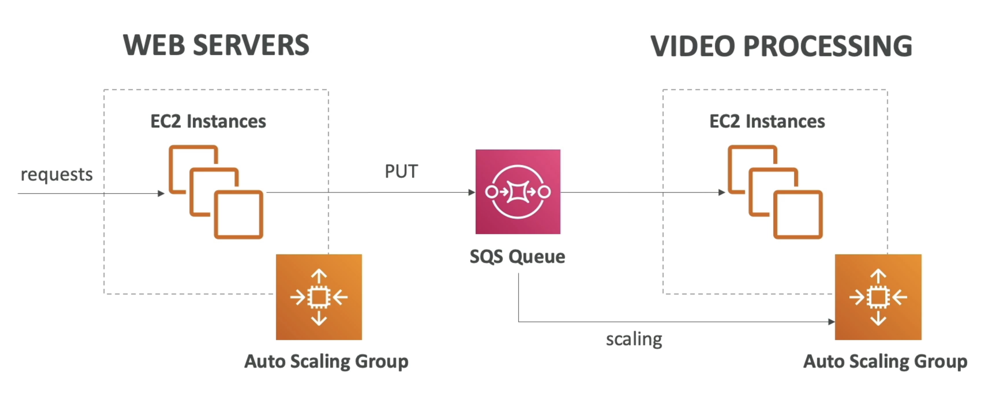

# SQS (Simple Queue Service)

- Oldest AWS offering (over 10 years old)
- Fully managed service (~serverless), used to decouple applications
- Scales from 1 message per second to 10,000s per second
- Default retention of messages: 4 days, maximum of 14 days
- No limit to how many messages can be in the queue
- Messages are deleted after they're read by consumers
- Low latency (&lt;10 ms on publish and receive)
- Consumers share the work to read messages & scale horizontally

# Decoupling applications

# FIFO Queues

