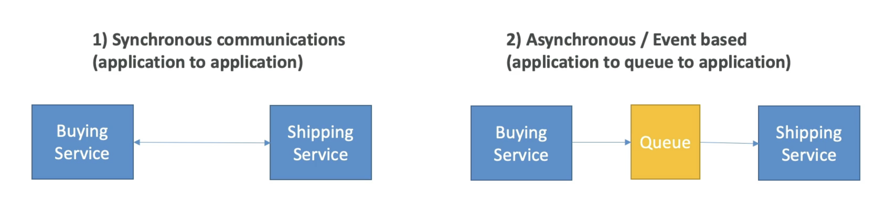

# Introduction
- When we start deploying multiple applications, they will inevitably need to communicate with one another
- There are two patterns of application communication

- Synchronous between applications can be problematic if there are sudden spikes of traffic
- What if you need to suddenly encode 1000 videos but usually it's 10?
- In that case, it's better to decouple your applications:
    - using SQS: queue model
    - using SNS: pub/sub model
    - using Kinesis: real-time data streaming model
- These services can scale independently from our application!

# Summary
- SQS:
    - Queue service in AWS
    - Multiple Producers, messages are kept up to 14 days
    - Multiple Consumers share the read and delete messages when done
    - Used to decouple applications in AWS
- SNS:
    - Notification service in AWS
    - Subscribers: Email, Lambda, SQS, HTTP, Mobile...
    - Multiple Subscribers, send all messages to all of them
    - No message retention
- Kinesis: real-time data streaming, persistence and analysis
- Amazon MQ: managed message broker for ActiveMQ and RabbitMQ in the cloud (MQ I I,AMQP.. protocols)