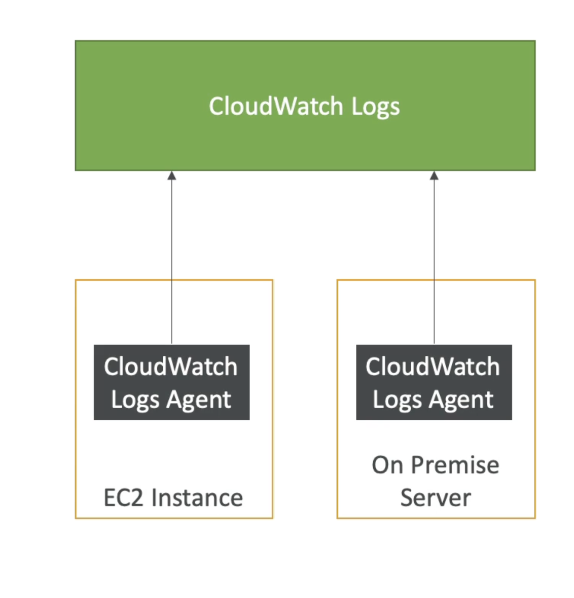

# CloudWatch Log
- CloudWatch Logs can collect log from:
    - Elastic Beanstalk: collection of logs from application
    - ECS: collection from containers
    - AWS Lambda: collection from function logs
    - CloudTrail based on filter
    - CloudWatch log agents: on EC2 machines or on-premises servers
    - Route53: Log DNS queries
- Enables real-time monitoring of logs
- Adjustable CloudWatch Logs retention

# CloudWatch Log on EC2

- By default, no logs from your EC2 instance will go to CloudWatch
- You need to run a CloudWatch agent on EC2 to push the log files you want
- Make sure IAM permissions are correct
- The CloudWatch log agent can be setup on-premises too