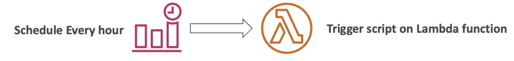
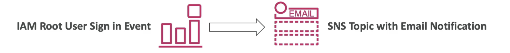
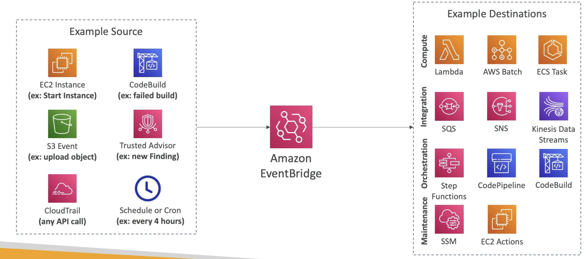
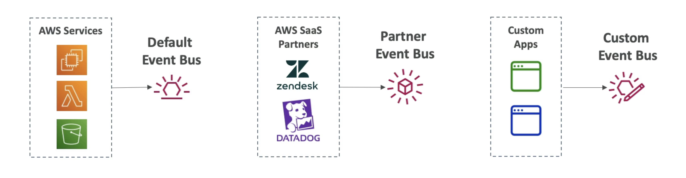

# EventBridge
- Schedule: Cron jobs (scheduled scripts)

- Event Pattern: Event rules to react to a service doing something

- Trigger Lambda functions, send SQS/SNS messages...

Example:

---

- Schema Registry: model event schema
- You can archive events (all/filter) sent to an event bus (indefinitely or set period)
- Ability to replay archived events

