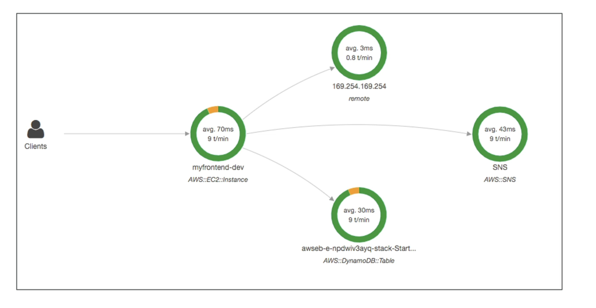

# X-ray
- Debugging in Production, the good old way:
    - Test locally
    - Add log statements everywhere
    - Re-deploy in production
- Log formats differ across applications and log analysis is hard.
- Debugging: one big monolith "easy", distributed services "hard"
- No common views of your entire architecture
## Example:

# Advantages
- Troubleshooting performance (bottlenecks)
- Understand dependencies in a microservice architecture
- Pinpoint service issues
- Review request behavior
- Find errors and exceptions
- Are we meeting time SLA?
- Where I am throttled?
- Identify users that are impacted