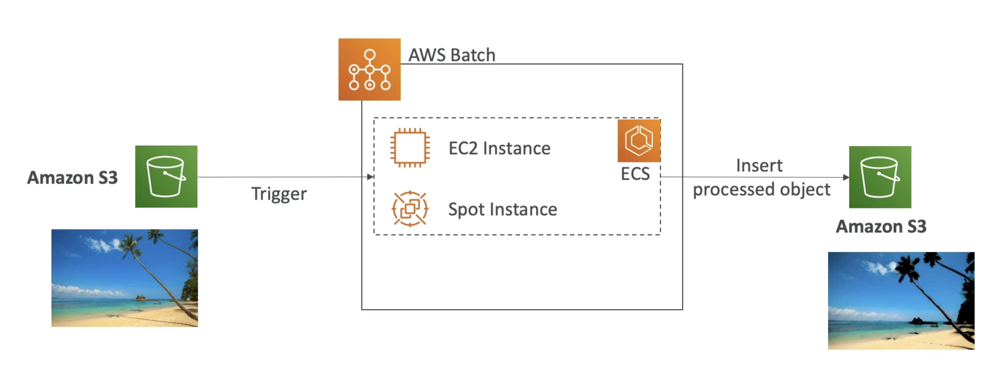

# AWS Batch
- Fully managed batch processing at any scale
- Efficiently run 100,000s of computing batch jobs on AWS
- A "batch" job is a job with a start and an end (opposed to continuous)
- Batch will dynamically launch EC2 instances or Spot Instances
- AWS Batch provisions the right amount of compute / memory
- You submit or schedule batch jobs and AWS Batch does the rest!
- Batch jobs are defined as Docker images and run on ECS
- Helpful for cost optimizations and focusing less on the infrastructure
# Example: running a batch job

# AWS Batch vs Lambda
## AWS Batch
- No time limit
- Any runtime as long as it's packaged as a Docker image
- Rely on EBS / instance store for disk space
- Relies on EC2 (can be managed by AWS)
## Lambda
- 15 minutes time limit
- Limited runtimes
- Limited temporary disk space
- Serverless