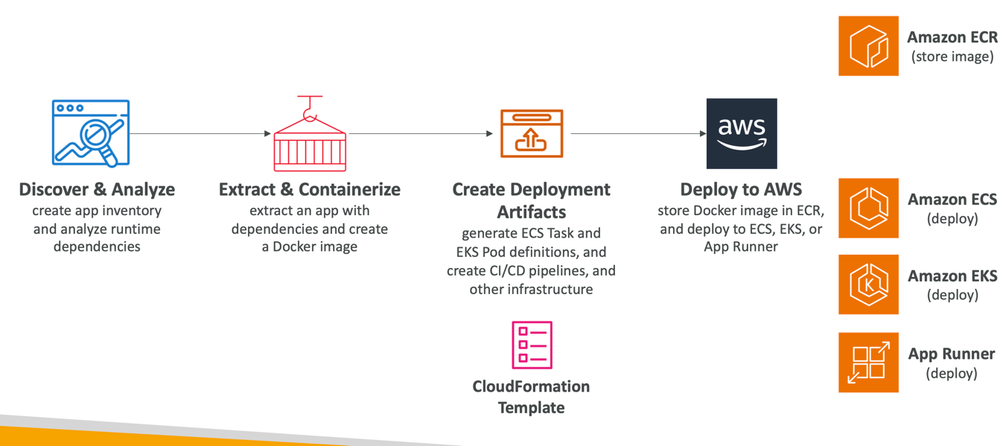

# A2C (Application Load Balancer to Container)
- CLI tool for migrating and modernizing Java and .NET web apps into Docker Containers
- Lift-and-shift your apps running in on-premises bare metal, virtual machines, or in any Cloud to AWS
- Accelerate modernization, no code changes, migrate legacy apps…
- Generates CloudFormation templates (compute, network…)
- Register generated Docker containers to ECR
- Deploy to ECS, EKS, or App Runner
- Supports pre-built CI/CD pipelines

