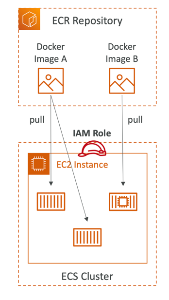

# ECR (Elastic Container Registry)

- ECR = Elastic Container Registry
- Store and manage Docker images on AWS
- Private and Public repository (Amazon ECR Public Gallery https://gallery.ecr.aws)
- Fully integrated with ECS, backed by Amazon S3
- Access is controlled through IAM (permission errors => policy)
- Supports image vulnerability scanning, versioning, image tags, image lifecycle, …

