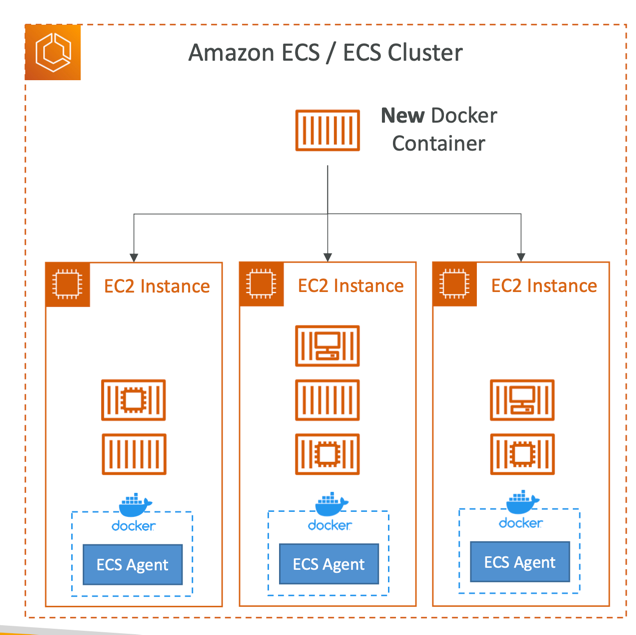
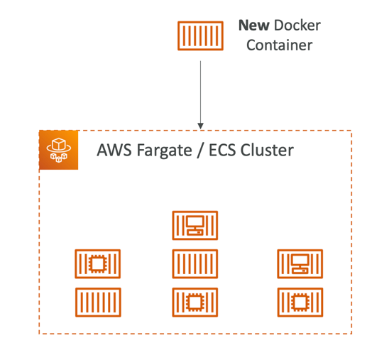
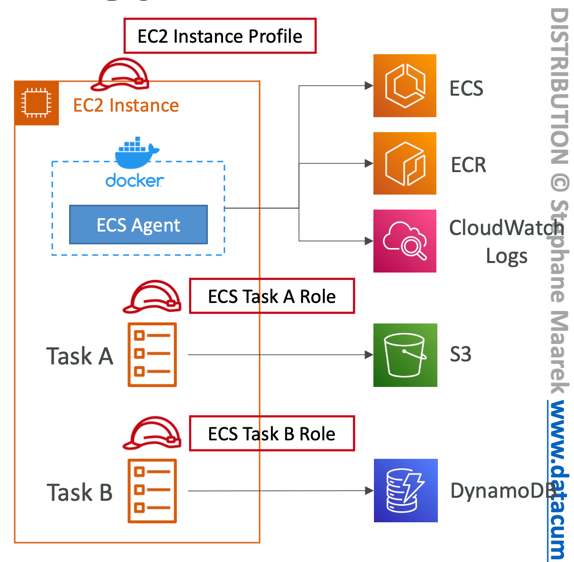
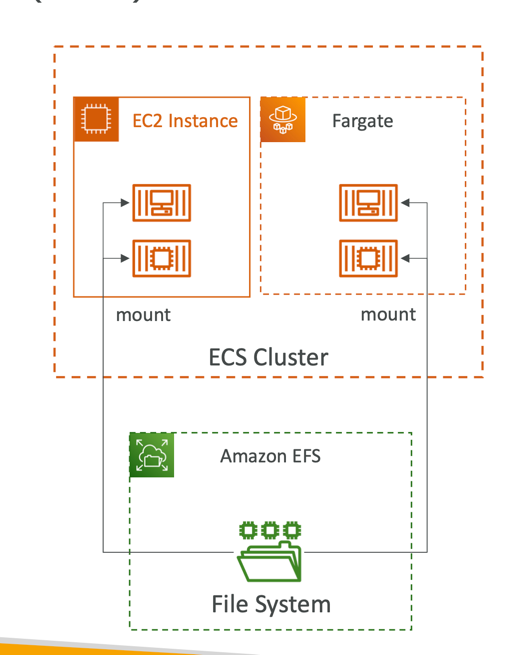

# ECS (Elastic Container Service)

- ECS = Elastic Container Service
- Launch Docker containers on AWS
- You must provision & maintain the infrastructure (the EC2 instances)
- AWS takes care of starting / stopping containers
- Has integrations with the Application Load Balancer

## Launch Types
### EC2 Launch Type

- Launch Docker containers on AWS = Launch ECS Tasks on ECS Clusters
- EC2 Launch Type: you must provision & maintain the infrastructure (the EC2 instances)
- Each EC2 Instance must run the ECS Agent to register in the ECS Cluster
- AWS takes care of starting / stopping containers

### Fargate Launch Type

- Launch Docker containers on AWS
- You do not provision the infrastructure(no EC2 instances to manage)
- It’s all Serverless!
- You just create task definitions
- AWS just runs ECS Tasks for you based on the CPU / RAM you need
- To scale, just increase the number of tasks. Simple - no more EC2 instances

## IAM Roles for ECS
- EC2 Instance Profile (EC2 Launch Type only):
    - Used by the ECS agent
    - Makes API calls to ECS service
    - Send container logs to CloudWatch Logs
    - Pull Docker image from ECR
    - Reference sensitive data in Secrets Manager or SSM Parameter Store
- ECS Task Role:
    - Allows each task to have a specific role
    - Use different roles for the different ECS Services you run
    - Task Role is defined in the task definition

## Load Balancing Integration
- Application Load Balancer supported and works for most use cases
- Network Load Balancer recommended only for high throughput / high performance use cases, or to pair it with AWS Private Link
- Classic Load Balancer supported but not recommended (no advanced features - no Fargate)

## Data Volumes
- Mount EFS file systems onto ECS tasks
- Works for both EC2 and Fargate launch types
- Tasks running in any AZ will share the same data in the EFS file system
- Fargate + EFS = Serverless
- Use cases: persistent multi-AZ shared storage for your containers
- Note:
- Amazon S3 cannot be mounted as a file system

