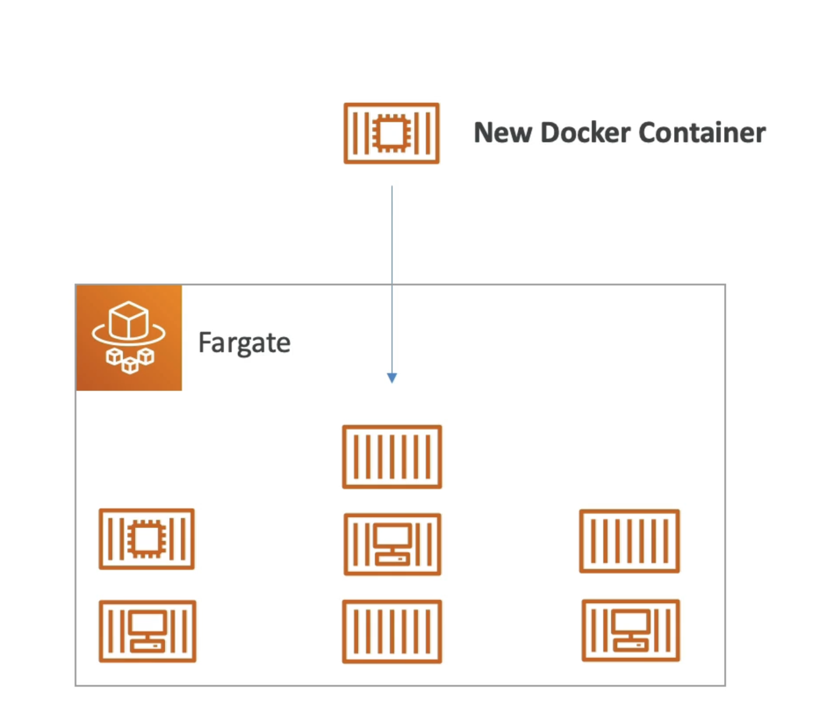

# Fargate

- Launch Docker containers on AWS
- You do not provision the infrastructure (no EC2 instances to manage) - simpler!
- Serverless offering
- AWS just runs containers for you based on the CPU / RAM you need

