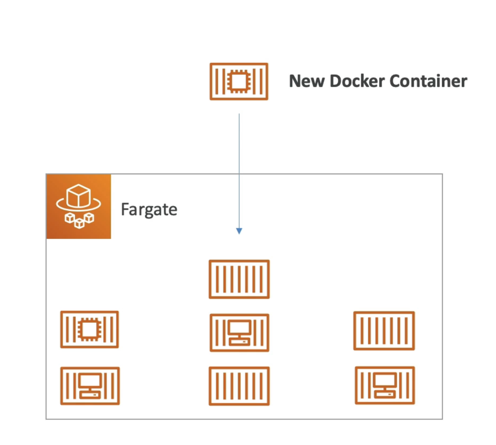

# Fargate

- Launch Docker containers on AWS
- You do not provision the infrastructure (no EC2 instances to manage) - simpler!
- Serverless offering
- AWS just runs containers for you based on the CPU / RAM you need

# ECR (Elastic Container Registry)

- Elastic Container Registry
- Private Docker Registry on AWS
- This is where you store your Docker images so they can be run by ECS or Fargate

# EKS (Elastic Kubernetes Service)

- EKS = Elastic Kubernetes Service
- Allows you to launch managed Kubernetes clusters on AWS
- Kubernetes is an open-source system for management, deployment, and scaling of containerized apps (Docker)
- Containers can be hosted on:
- EC2 instances
- Fargate (Serverless)
- Kubernetes is cloud-agnostic
(can be used in any cloud - Azure, GCP...)