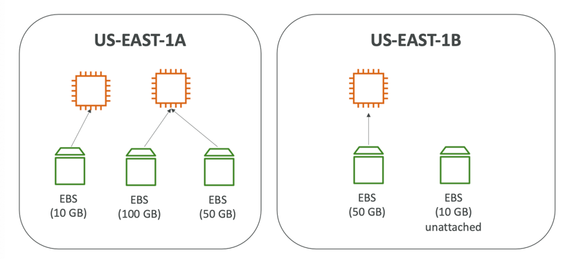
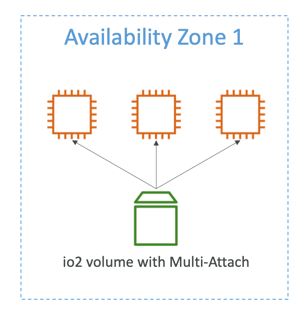
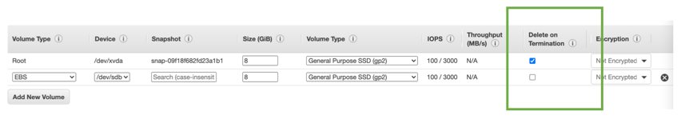
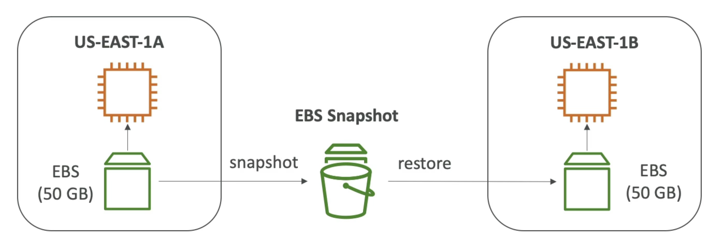
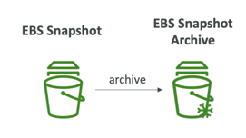
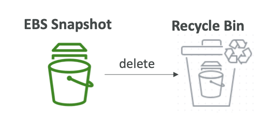

# Introduction to EBS
- An EBS (Elastic Block Store) Volume is a network drive you can attach to your instances while they run
- It allows your instances to persist data, even after their termination
- They are bound to a specific availability zone
- Analogy:Think of them as a "network USB stick"
# EBS Volume

- It’s a network drive (i.e. not a physical drive)
    - It uses the network to communicate the instance, which means there might be a bit of latency
    - It can be detached from an EC2 instance and attached to another one quickly
- It’s locked to an Availability Zone (AZ)
    - An EBS Volume in us-east-1a cannot be attached to us-east-1b
    - To move a volume across, you first need to snapshot it
- Have a provisioned capacity (size in GBs, and IOPS)
    - You get billed for all the provisioned capacity
    - You can increase the capacity of the drive over time
# EBS Volume Types
- EBS Volumes come in 6 types
### gp2 / gp3 (SSD)
- General purpose SSD volume that balances price and performance for a wide variety of workloads
- Cost effective storage, low-latency
- System boot volumes, Virtual desktops, Development and test environments
- 1 GiB - 16 TiB
#### gp3:
- Baseline of 3,000 IOPS and throughput of 125 MiB/s
- Can increase IOPS up to 16,000 and throughput up to 1000 MiB/s independently
#### gp2:
- Small gp2 volumes can burst IOPS to 3,000
- Size of the volume and IOPS are linked, max IOPS is 16,000
- 3 IOPS per GB, means at 5,334 GB we are at the max IOPS

### io1 / io2 Block Express (SSD)
- Highest-performance SSD volume for mission-critical low-latency or high-throughput workloads
- Critical business applications with sustained IOPS performance
- Or applications that need more than 16,000 IOPS
- Great for databases workloads (sensitive to storage perf and consistency)
#### io1 (4 GiB - 16 TiB)
- Max PIOPS: 64,000 for Nitro EC2 instances & 32,000 for other
- Can increase PIOPS independently from storage size
#### io2 Block Express (4 GiB – 64 TiB)
- Sub-millisecond latency
- Max PIOPS: 256,000 with an IOPS:GiB ratio of 1,000:1
- Supports EBS Multi-attach
### st1 / sc1 (HDD)
- Cannot be a boot volume
- 125 GiB to 16 TiB
#### st1 (HDD)
- Low cost HDD volume designed for frequently accessed, throughput intensive workloads
- Big Data, Data Warehouses, Log Processing
- Max throughput 500 MiB/s – max IOPS 500
#### sc1 (HDD)
- Lowest cost HDD volume designed for less frequently accessed workloads
- For data that is infrequently accessed
- Scenarios where lowest cost is important
- Max throughput 250 MiB/s – max IOPS 250
## EBS Multi-Attach

- Attach the same EBS volume to multiple EC2 instances in the same AZ
- Each instance has full read & write permissions to the high-performance volume
- Use case:
- Achieve higher application availability in clustered Linux applications (ex: Teradata)
- Applications must manage concurrent write operations
- Up to 16 EC2 Instances at a time
- Must use a file system that’s cluster-aware (not XFS, EXT4, etc…
## Summary
- EBS Volumes are characterized in Size | Throughput | IOPS (I/O Ops Per Sec)
- When in doubt always consult the AWS documentation – it’s good!
- Only gp2/gp3 and io1/io2 Block Express can be used as boot volumes

# EBS Encryption
- When you create an encrypted EBS volume, you get the following:
    - Data at rest is encrypted inside the volume
    - All the data in flight moving between the instance and the volume is encrypted
    - All snapshots are encrypted
    - All volumes created from the snapshot
- Encryption and decryption are handled transparently (you have nothing to do)
- Encryption has a minimal impact on latency
- EBS Encryption leverages keys from KMS (AES-256)
- Copying an unencrypted snapshot allows encryption
- Snapshots of encrypted volumes are encrypted
# Encryption: encrypt an unencrypted EBS volume
1. Create an EBS snapshot of the volume
2. Encrypt the EBS snapshot ( using copy )
3. Create new ebs volume from the snapshot ( the volume will also be encrypted )
4. Now you can attach the encrypted volume to the original instance

# EBS - Delete on Termination attribute

- Controls the EBS behaviour when an EC2 instance terminates
    - By default, the root EBS volume is deleted (attribute enabled)
    - By default, any other attached EBS volume is not deleted (attribute disabled)
- This can be controlled by the AWS console / AWS CLI
- Use case: preserve root volume when instance is terminated

# EBS Snapshots
- Make a backup (snapshot) of your EBS volume at a point in time
- Not necessary to detach volume to do snapshot, but recommended
- Can copy snapshots across AZ or regions

## EBS Snapshot Archive

- Move a Snapshot to an "archive tier" that is 75% cheaper
- Takes within 24 to 72 hours for restoring the archive
## Recycle Bin for EBS Snapshots

- Setup rules to retain deleted snapshots so you can recover them after an accidental deletion
- Specify retention (from 1 day to 1 year)
## Fast Snapshot Restore (FSR)
- Force full initialization of snapshot to have no latency on the first read