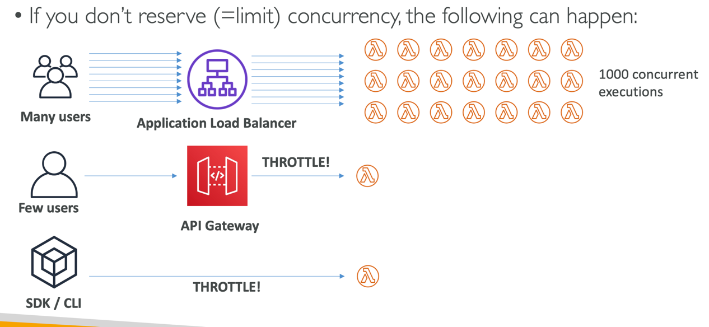
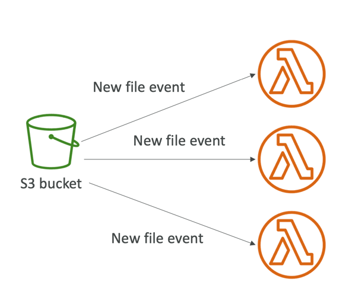
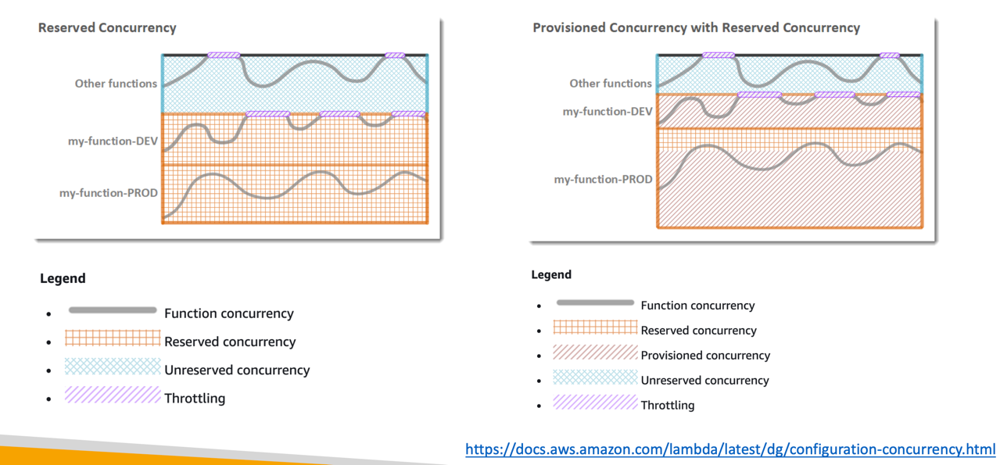
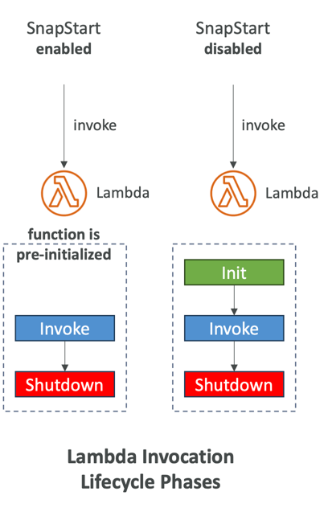
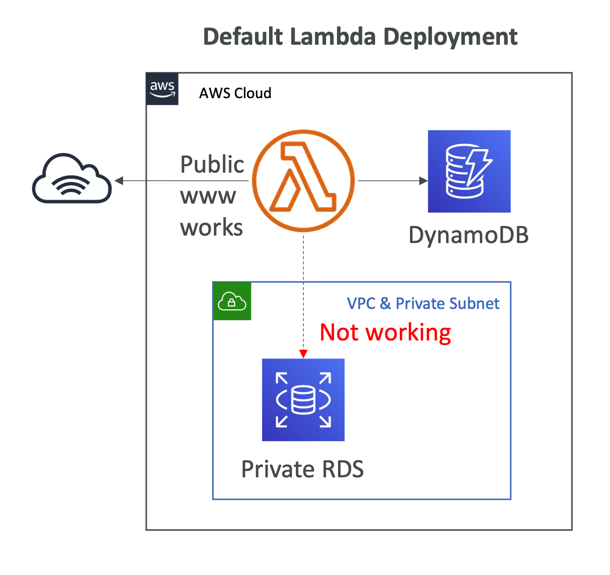
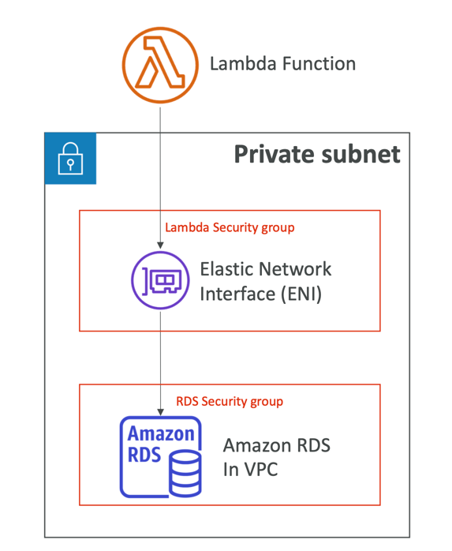
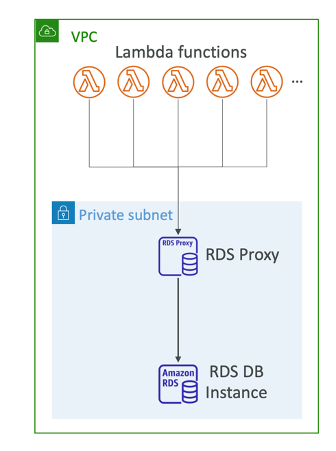
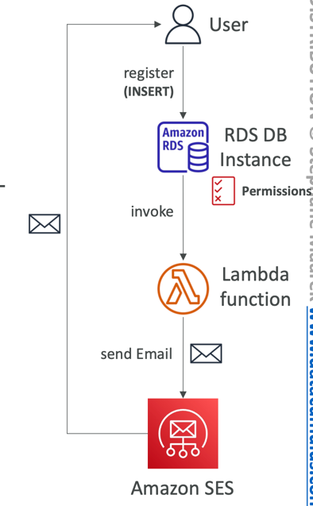

# Lambda vs EC2
Lambda:
- Virtual functions - no servers to manage!
- Limited by time - short executions
- Run on-demand
- Scaling is automated!
---
EC2:
- Virtual Servers in the Cloud
- Limited by RAM and CPU
- Continuously running
- Scaling means intervention to add / remove servers

# Benefits of Lambda
- Easy Pricing:
    - Pay per request and compute time
    - Free tier of 1,000,000 AWS Lambda requests and 400,000 GBs of compute time
- Integrated with the whole AWS suite of services
- Event-Driven: functions get invoked by AWS when needed
- Integrated with many programming languages
- Easy monitoring through AWS Cloud Watch
- Easy to get more resources per functions (up to I0GB of RAM!)
- Increasing RAM will also improve CPU and network!

# AWS Lambda languages supported
- Node.js (JavaScript)
- Python
- Java
- C# (NET Core) / Powershell
- Ruby
- Custom Runtime API (community supported, example Rust or Golang)
- Lambda Container Image
- The container image must implement the Lambda Runtime API
- ECS / Fargate is preferred for running arbitrary Docker images

# AWS Lambda Pricing
- Pay per calls:
    - First 1,000,000 requests are free
    - $0.20 per | million requests thereafter ($0.0000002 per request)
- Pay per duration: (in increment of 1 ms)
    - 400,000 GB-seconds of compute time per month if FREE
    - == 400,000 seconds if function is IGB RAM
    -== 3,200,000 seconds if function is 128 MB RAM
    - After that $1.00 for 600,000 GB-seconds
- It is usually very cheap to run AWS Lambda so it's very popular

## AWS Lambda Integrations Main Services

## Example: Serverless Thumbnail Generation

## Example: Serverless CRON Job

## Lambda Concurrency and Throttling
- Concurrency limit: up to 1000 concurrent executions

- Can set a “reserved concurrency” at the function level (=limit)
- Each invocation over the concurrency limit will trigger a “Throttle”
- Throttle behavior:
- If synchronous invocation => return ThrottleError - 429
- If asynchronous invocation => retry automatically and then go to DLQ
- If you need a higher limit, open a support ticket

### Lambda Concurrency Issue

## Concurrency and Asynchronous Invocations
- If the function doesn't have enough concurrency available to process all events, additional requests are throttled.
- For throttling errors (429) and system errors (500-series), Lambda returns the event to the queue and attempts to run the function again for up to 6 hours.
- The retry interval increases exponentially from 1 second after the first attempt to a maximum of 5 minutes.

## Cold Starts & Provisioned Concurrency
- Cold Start:
  - New instance => code is loaded and code outside the handler run (init)
  - If the init is large (code, dependencies, SDK…) this process can take some time.
  - First request served by new instances has higher latency than the rest
- Provisioned Concurrency:
  - Concurrency is allocated before the function is invoked (in advance)
  - So the cold start never happens and all invocations have low latency
  - Application Auto Scaling can manage concurrency (schedule or target utilization)
- Note:
  - Note: cold starts in VPC have been dramatically reduced in Oct & Nov 2019
  - https://aws.amazon.com/blogs/compute/announcing-improved-vpc-networking-for-aws-lambda-functions/

## Reserved and Provisioned Concurrency

## Lambda SnapStart
- Improves your Lambda functions performance up to 10x at no extra cost for Java, Python & .NET
- When enabled, function is invoked from a pre- initialized state (no function initialization from scratch)
- When you publish a new version:
- Lambda initializes your function
- Takes a snapshot of memory and disk state of the initialized function
- Snapshot is cached for low-latency access

## Customization At The Edge
- Many modern applications execute some form of the logic at the edge
- Edge Function:
- A code that you write and attach to CloudFront distributions
- Runs close to your users to minimize latency
- CloudFront provides two types: CloudFront Functions & Lambda@Edge
- You don’t have to manage any servers, deployed globally
- Use case: customize the CDN content
- Pay only for what you use
- Fully serverless

### CloudFront Functions & Lambda@Edge Use Cases
- Website Security and Privacy
- Dynamic Web Application at the Edge
- Search Engine Optimization (SEO)
- Intelligently Route Across Origins and Data Centers
- Bot Mitigation at the Edge
- Real-time Image Transformation
- A/B Testing
- User Authentication and Authorization
- User Prioritization
- User Tracking and Analytics

## Lambda by default
- By default, your Lambda function is launched outside your own VPC (in an AWS-owned VPC)
- Therefore, it cannot access resources in your VPC (RDS, ElastiCache, internal ELB…)

## Lambda in VPC
- You must define the VPC ID, the Subnets and the Security Groups
- Lambda will create an ENI (Elastic Network Interface) in your subnets

## Lambda with RDS Proxy
- If Lambda functions directly access your database, they may open too many connections under high load
- RDS Proxy
  - Improve scalability by pooling and sharing DB connections
  - Improve availability by reducing by 66% the failover time and preserving connections
  - Improve security by enforcing IAM authentication and storing credentials in Secrets Manager
- The Lambda function must be deployed in your VPC, because RDS Proxy is never publicly accessible

## Invoking Lambda from RDS & Aurora
- Invoke Lambda functions from within your DB instance
- Allows you to process data events from within a database
- Supported for RDS for PostgreSQL and Aurora MySQL
- Must allow outbound traffic to your Lambda function from within your DB instance (Public, NAT GW, VPC Endpoints)
- DB instance must have the required permissions to invoke the Lambda function (Lambda Resource-based Policy & IAM Policy)

