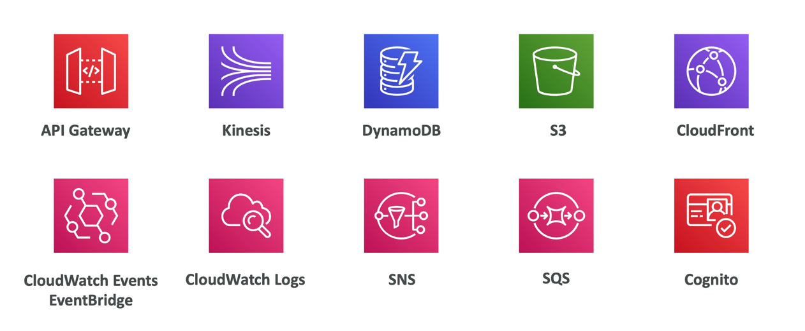
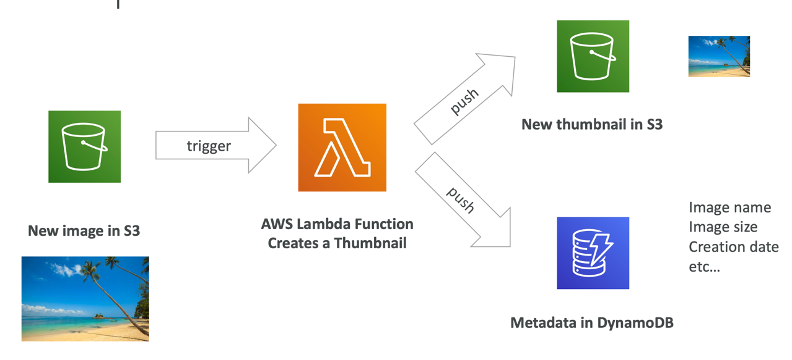
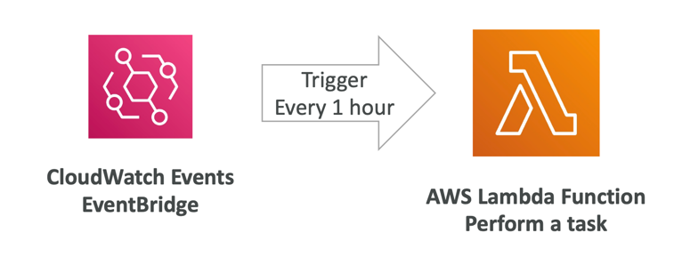
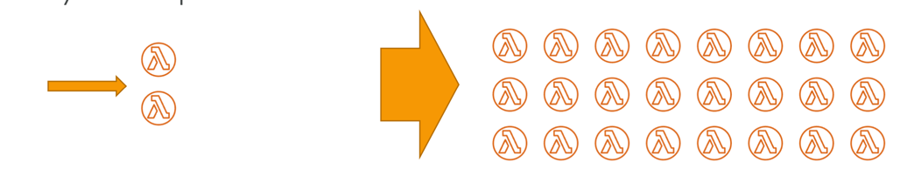

# Lambda vs EC2
Lambda:
- Virtual functions - no servers to manage!
- Limited by time - short executions
- Run on-demand
- Scaling is automated!
---
EC2:
- Virtual Servers in the Cloud
- Limited by RAM and CPU
- Continuously running
- Scaling means intervention to add / remove servers

# Benefits of Lambda
- Easy Pricing:
    - Pay per request and compute time
    - Free tier of 1,000,000 AWS Lambda requests and 400,000 GBs of compute time
- Integrated with the whole AWS suite of services
- Event-Driven: functions get invoked by AWS when needed
- Integrated with many programming languages
- Easy monitoring through AWS Cloud Watch
- Easy to get more resources per functions (up to I0GB of RAM!)
- Increasing RAM will also improve CPU and network!

# AWS Lambda languages supported
- Node.js (JavaScript)
- Python
- Java
- C# (NET Core) / Powershell
- Ruby
- Custom Runtime API (community supported, example Rust or Golang)
- Lambda Container Image
- The container image must implement the Lambda Runtime API
- ECS / Fargate is preferred for running arbitrary Docker images

# AWS Lambda Pricing
- Pay per calls:
    - First 1,000,000 requests are free
    - $0.20 per | million requests thereafter ($0.0000002 per request)
- Pay per duration: (in increment of 1 ms)
    - 400,000 GB-seconds of compute time per month if FREE
    - == 400,000 seconds if function is IGB RAM
    -== 3,200,000 seconds if function is 128 MB RAM
    - After that $1.00 for 600,000 GB-seconds
- It is usually very cheap to run AWS Lambda so it's very popular

## AWS Lambda Integrations Main Services

## Example: Serverless Thumbnail Generation

## Example: Serverless CRON Job

## Lambda Concurrency and Throttling
- Concurrency limit: up to 1000 concurrent executions

- Can set a “reserved concurrency” at the function level (=limit)
- Each invocation over the concurrency limit will trigger a “Throttle”
- Throttle behavior:
- If synchronous invocation => return ThrottleError - 429
- If asynchronous invocation => retry automatically and then go to DLQ
- If you need a higher limit, open a support ticket

