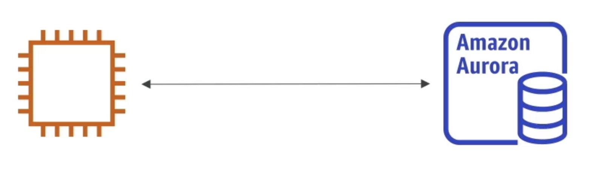
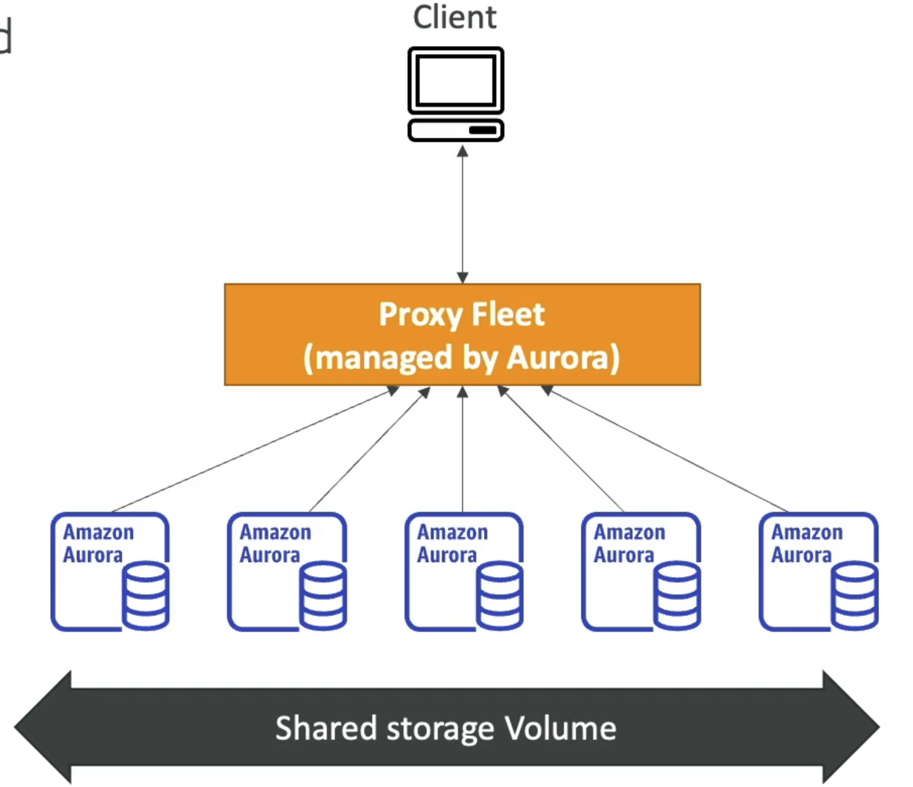

# Amazon Aurora

- Aurora is a proprietary technology from AWS (not open sourced)
- PostgreSQL and MySQL are both supported as Aurora DB
- Aurora is "AWS cloud optimized" and claims 5x performance improvement over MySQL on RDS, over 3x the performance of Postgres on RDS
- Aurora storage automatically grows in increments of IOGB, up to 128 TB
- Aurora costs more than RDS (20% more) - but is more efficient
- Not in the free tier

# Amazon Aurora Serverless

- Automated database instantiation and auto-scaling based on actual usage
- PostgreSQL and MySQL are both supported as Aurora Serverless DB
- No capacity planning needed
- Least management overhead
- Pay per second, can be more cost-effective
- Use cases: good for infrequent, intermittent or unpredictable workloads...
