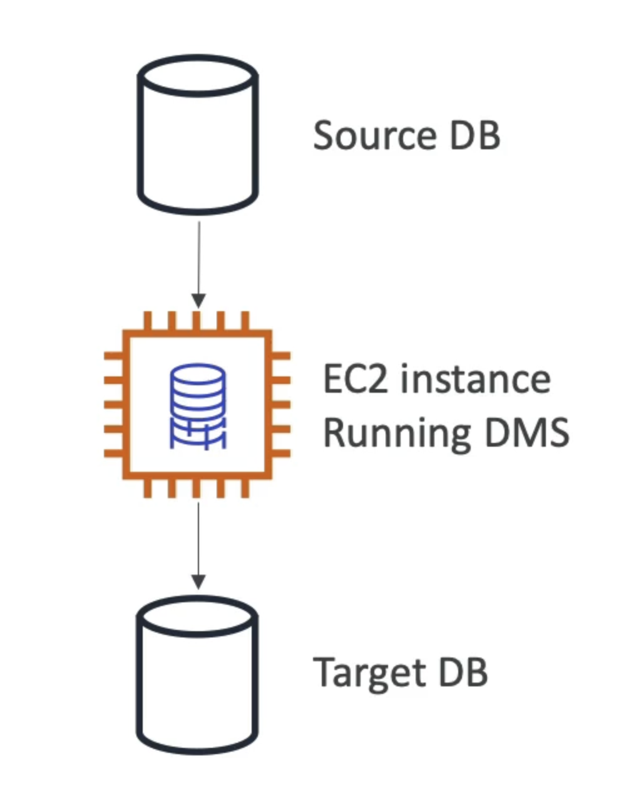

# DMS (Database Migration Service)
- Quickly and securely migrate databases to AWS, resilient, self healing
- The source database remains available during the migration
- Supports:
- Homogeneous migrations: ex Oracle toOracle
- Heterogeneous migrations: ex Microsoft SQL Server to Aurora