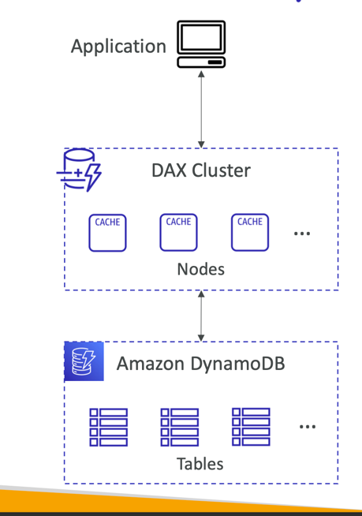

# overview
- Fully Managed Highly available with replication across 3 AZ
- NoSQL database - not a relational database
- Scales to massive workloads, distributed "serverless" database
- Millions of requests per seconds, trillions of row, 100s of TB of storage
- Fast and consistent in performance
- Single-digit millisecond latency - low latency retrieval
- Integrated with IAM for security, authorization and administration
- Low cost and auto scaling capabilities
- Standard & Infrequent Access (IA) Table Class

# DynamoDB Data type
- DynamoDB is a key/value database

# DynamoDB Accelerator - DAX

- Fully Managed in-memory cache for DynamoDB
- 10x performance improvement - single-digit millisecond latency to microseconds latency - when accessing your DynamoDB tables
- Secure, highly scalable & highly available
- Difference with ElastiCache at the CCP level: DAX is only used for and is integrated with DynamoDB, while ElastiCache can be used for other databases

# DynamoDB Global Tables

- Make a DynamoDB table accessible with low latency in multiple-regions
- Active-Active replication (read/write to any AWS Region)