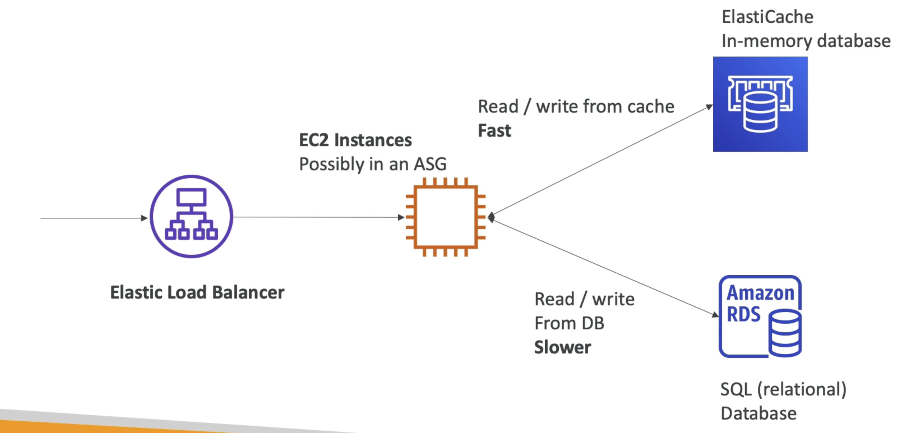
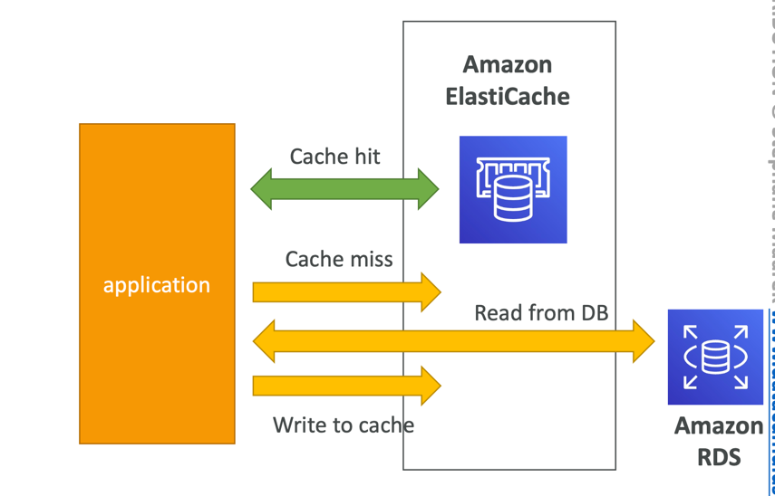
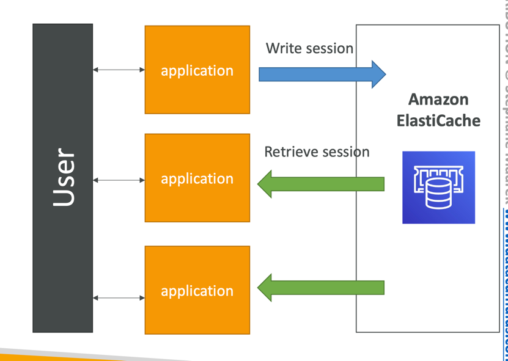
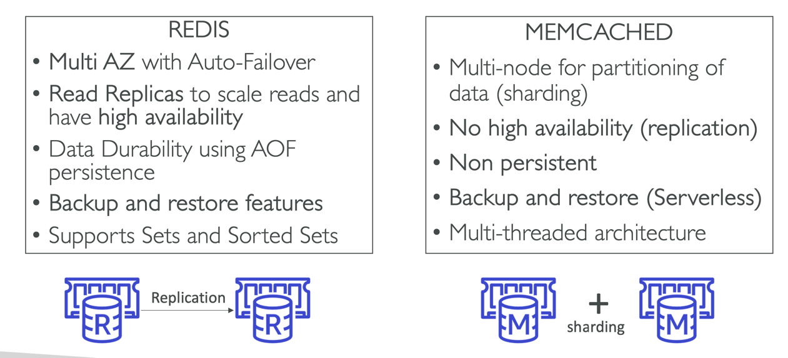
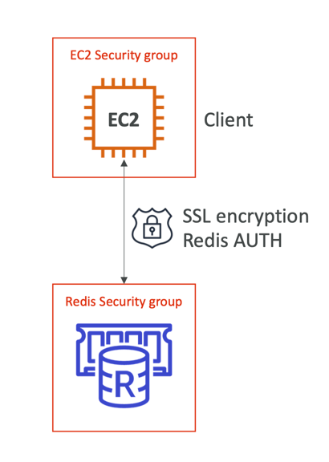
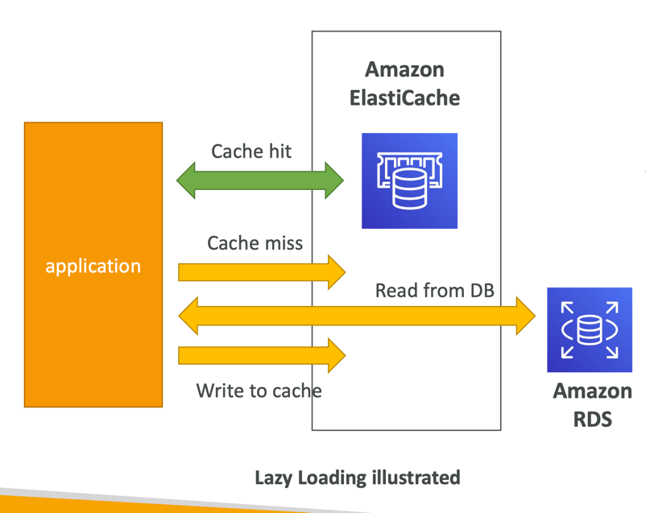
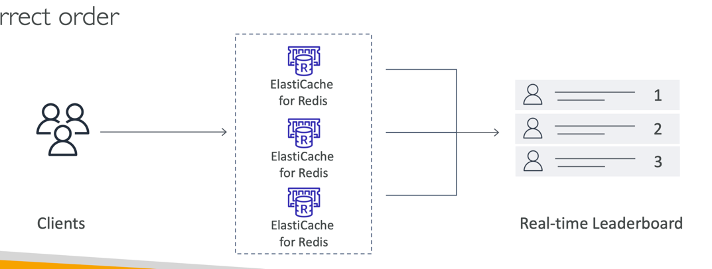

# ElastiCache

- The same way RDS is to get managed Relational Databases...
- ElastiCache is to get managed Redis or Memcached
- Caches are in-memory databases with really high performance, low latency
- Helps reduce load off of databases for read intensive workloads
- Helps make your application stateless
- AWS takes care of OS maintenance / patching, optimizations, setup, configuration, monitoring, failure recovery and backups
- Using ElastiCache involves heavy application code changes

## Solutions Architecture
### DB Cache

- Applications queries ElastiCache, if not available, get from RDS and store in ElastiCache.
- Helps relieve load in RDS
- Cache must have an invalidation strategy to make sure only the most current data is used in there.
### User Session Store

- User logs into any of the application
- The application writes the session data into ElastiCache
- The user hits another instance of our application
- The instance retrieves the data and the user is already logged in

## ElasticCache - Redis vs Memcached

## Security
- ElastiCache supports IAM Authentication for Redis
- IAM policies on ElastiCache are only used for AWS API-level security
- Redis AUTH
    - You can set a “password/token” when you create a Redis cluster
    - This is an extra level of security for your cache (on top of security groups)
    - Support SSL in flight encryption
- Memcached
    - Supports SASL-based authentication (advanced)

## Pattern for ElastiCache

- Lazy Loading: all the read data is cached, data can become stale in cache
- Write Through: Adds or update data in the cache when written to a DB (no stale data)
- Session Store: store temporary session data in a cache (using TTL features)

## ElastiCache use cases
- Gaming Leaderboards are computationally complex
- Redis Sorted sets guarantee both uniqueness and element ordering
- Each time a new element added, it’s ranked in real time, then added in correct order
