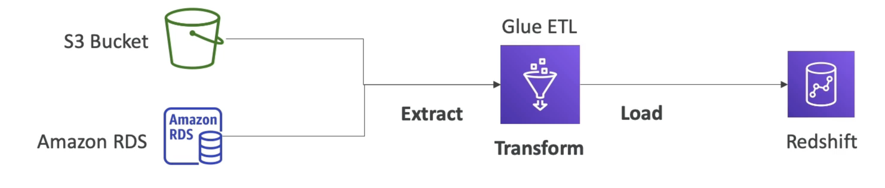

# Amazon Glue

- Managed extract, transform, and load (ETL) service
- Useful to prepare and transform data for analytics
- Fully serverless service
# Glue Data Catalog: Catalog of dataset

- can be used by Athena, Redshift,EMR
