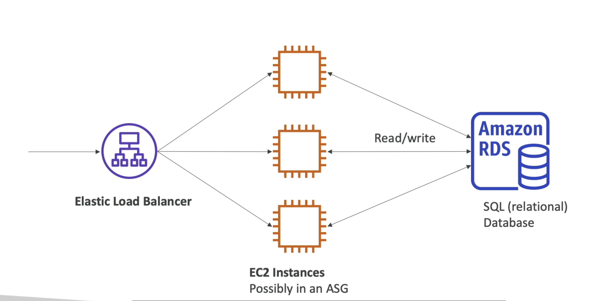
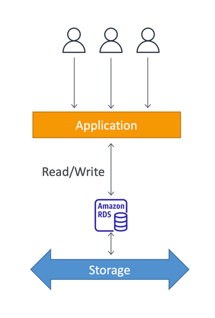
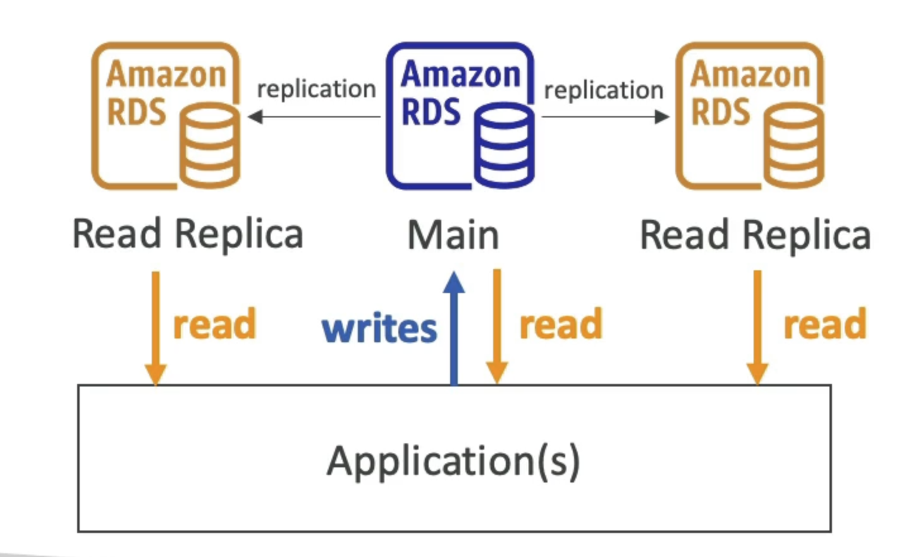
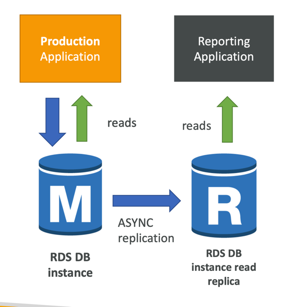
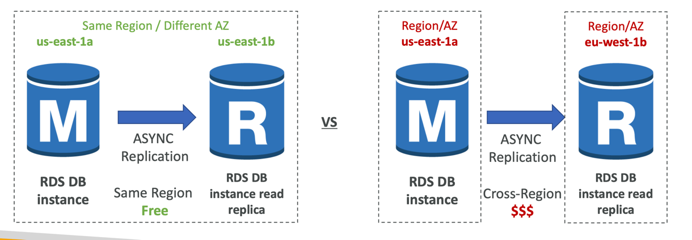
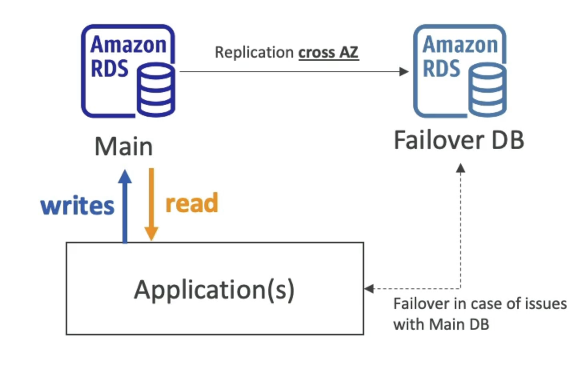
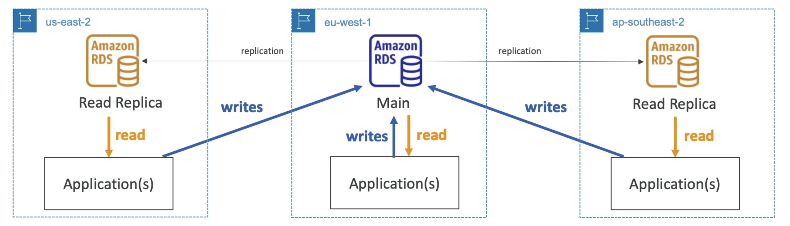
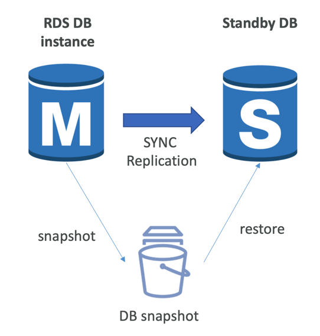
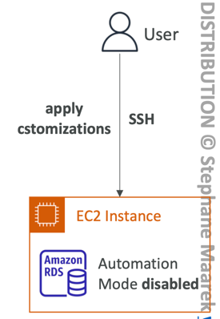
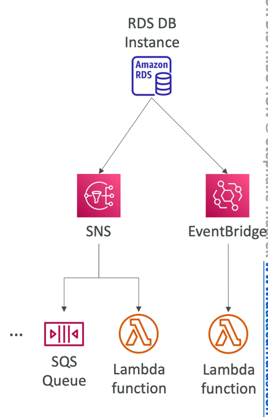

# Introduction
- RDS stands for Relational Database Service
- It's a managed DB service for DB use SQL as a query language.
- It allows you to create databases in the cloud that are managed by AWS
- Postgres
- MySQL
- MariaDB
- Oracle
- Microsoft SQL Server
- IBM DB2
- Aurora (AWS Proprietary database)

# Benefits
- RDS is a managed service:
  - Automated provisioning, OS patching
  - Continuous backups and restore to specific timestamp (Point in Time Restore)!
  - Monitoring dashboards
  - Read replicas for improved read performance
  - Multi AZ setup for DR (Disaster Recovery)
  - Maintenance windows for upgrades
  - Scaling capability (vertical and horizontal)
  - Storage backed by EBS
- BUT you can't SSH into your instances

# RDS Storage Auto Scaling - 
- Helps you increase storage on your RDS DB instance dynamically
- When RDS detects you are ru
- Avoid manually scaling your database storage
- You have to set Maximum Storage Threshold (maximum limit for DB storage)
- Automatically modify storage if:
- Free storage is less than 10% of allocated storage
- Low-storage lasts at least 5 minutes
- 6 hours have passed since last modification
- Useful for applications with unpredictable workloads
- Supports all RDS database engines

# RDS Deployment
## RDS Read Replicas

- Up to 15 Read Replicas
- Within AZ, Cross AZ or Cross Region
- Replication is ASYNC, so reads are eventually consistent
### Use cases:
- You have a production database that is taking on normal load
- You want to run a reporting application to run some analytics
- You create a Read Replica to run the new workload there
- The production application is unaffected
- Read replicas are used for SELECT(=read) only kind of statements(not INSERT, UPDATE, DELETE)

### Network cost:
- In AWS there’s a network cost when data goes from one AZ to another
- For RDS Read Replicas within the same region, you don’t pay that fee

## RDS Multi-AZ (Disaster Recovery)

- Fail over in case of AZ outage (high availability)
- Data is only read/written to the main database
- Can only have 1 other AZ as failover

## Multi-Region (Read Replicas)

- Disaster recovery in case of region issue
- Local performance for global reads
- Replication cost

### RDS From Single AZ to Multi-AZ

- Zero downtime operation (no need to stop the DB)
- Just click on “modify” for the database
- The following happens internally:
  - A snapshot is taken
  - A new DB is restored from the snapshot in a new AZ
  - Synchronization is established between the two databases

# RDS Custom

- Managed Oracle and Microsoft SQL Server Database with OS and database customization
- RDS: Automates setup, operation, and scaling of database in AWS
- Custom: access to the underlying database and OS so you can
  - Configure settings
  - Install patches
  - Enable native features
  - Access the underlying EC2 Instance using SSH or SSM Session Manager
- De-activate Automation Mode to perform your customization, better to take a DB snapshot before
- RDS vs. RDS Custom
- RDS: entire database and the OS to be managed by AWS
- RDS Custom: full admin access to the underlying OS and the database

# RDS Backup
- Automated backups:
  - Daily full backup of the database (during the backup window)
  - Transaction logs are backed-up by RDS every 5 minutes
  - => ability to restore to any point in time (from oldest backup to 5 minutes ago)
  - 1 to 35 days of retention, set 0 to disable automated backups
- Manual DB Snapshots
  - Manually triggered by the user
  - Retention of backup for as long as you want
- Trick: in a stopped RDS database, you will still pay for storage. If you plan on stopping it for a long time, you should snapshot & restore instead

# RDS and Aurora Restore Options
- Restoring a RDS / Aurora backup or a snapshot creates a new database
- Restoring MySQL RDS database from S3
  - Create a backup of your on-premises database
  - Store it on Amazon S3 (object storage)
  - Restore the backup file onto a new RDS instance running MySQL
- Restoring MySQL Aurora cluster from S3
  - Create a backup of your on-premises database using Percona XtraBackup
  - Store the backup file on Amazon S3
  - Restore the backup file onto a new Aurora cluster running MySQL

# RDS and Aurora Security
- At-rest encryption:
  - Database master & replicas encryption using AWS KMS – must be defined as launch time
  - If the master is not encrypted, the read replicas cannot be encrypted
  - To encrypt an un-encrypted database, go through a DB snapshot & restore as encrypted
- In-flight encryption: TLS-ready by default, use the AWS TLS root certificates client-side
- IAM Authentication: IAM roles to connect to your database (instead of username/pw)
- Security Groups: Control Network access to your RDS / Aurora DB
- No SSH available except on RDS Custom
- Audit Logs can be enabled and sent to CloudWatch Logs for longer retention

# RDS proxy
- Fully managed database proxy for RDS
- Allows apps to pool and share DB connections established with the database
- Improving database efficiency by reducing the stress on database resources (e.g., CPU, RAM) and minimize open connections (and timeouts)
- Serverless, autoscaling, highly available (multi-AZ)
- Reduced RDS & Aurora failover time by up 66%
- Supports RDS (MySQL, PostgreSQL, MariaDB, MS SQL Server) and Aurora (MySQL, PostgreSQL)
- No code changes required for most apps
- Enforce IAM Authentication for DB, and securely store credentials in AWS Secrets Manager
- RDS Proxy is never publicly accessible (must be access from VPC)

## RDS Event Notifications
- Notifications that tells information about the DB instance itself (created, stopped, start, …)
- You don’t have any information about the data itself
- Subscribe to the following event categories: DB instance, DB snapshot, DB Parameter Group, DB Security Group, RDS Proxy, Custom Engine Version
- Near real-time events (up to 5 minutes)
- Send notifications to SNS or subscribe to events using EventBridge

