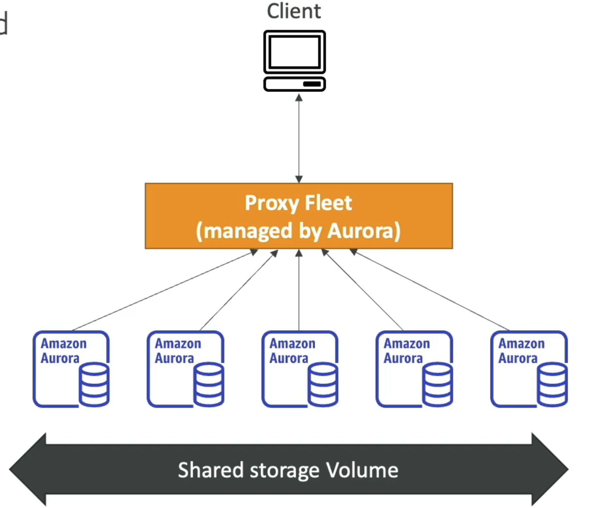

# Introduction
• RDS stands for Relational Database Service
• It's a managed DB service for DB use SQL as a query language.
• It allows you to create databases in the cloud that are managed by AWS
• Postgres
• MySQL
• MariaDB
• Oracle
• Microsoft SQL Server
• IBM DB2
• Aurora (AWS Proprietary database)

# Benefits
• RDS is a managed service:
• Automated provisioning, OS patching
• Continuous backups and restore to specific timestamp (Point in Time Restore)!
• Monitoring dashboards
• Read replicas for improved read performance
• Multi AZ setup for DR (Disaster Recovery)
• Maintenance windows for upgrades
• Scaling capability (vertical and horizontal)
• Storage backed by EBS
• BUT you can't SSH into your instances

# Amazon Aurora

• Aurora is a proprietary technology from AWS (not open sourced)
• PostgreSQL and MySQL are both supported as Aurora DB
• Aurora is "AWS cloud optimized" and claims 5x performance improvement over MySQL on RDS, over 3x the performance of Postgres on RDS
• Aurora storage automatically grows in increments of IOGB, up to 128 TB
• Aurora costs more than RDS (20% more) - but is more efficient
• Not in the free tier

# Amazon Aurora Serverless

• Automated database instantiation and auto-scaling based on actual usage
• PostgreSQL and MySQL are both supported as Aurora Serverless DB
• No capacity planning needed
• Least management overhead
• Pay per second, can be more cost-effective
• Use cases: good for infrequent, intermittent or unpredictable workloads...

# RDS Deployment
## RDS Read Replicas

• Scale the read workload of your DB
• Can create up to 15 Read Replicas
• Data is only written to the main DB

## RDS Multi-AZ (Disaster Recovery)

- Fail over in case of AZ outage (high availability)
• Data is only read/written to the main database
• Can only have 1 other AZ as failover

## Multi-Region (Read Replicas)

• Disaster recovery in case of region issue
• Local performance for global reads
• Replication cost
