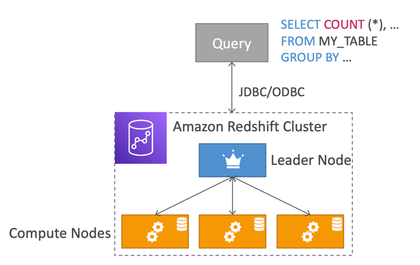
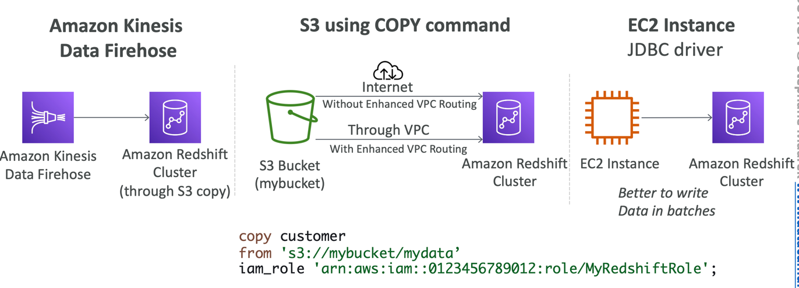
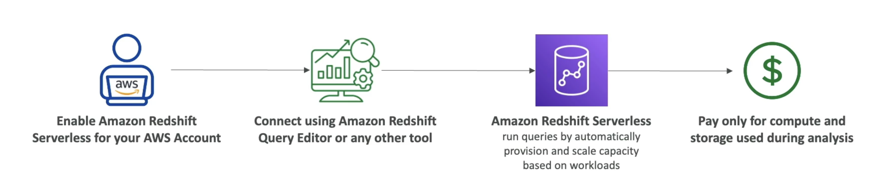

# Overview
• Redshift is based on PostgreSQL, but it’s not used for OLTP
• It’s OLAP – online analytical processing (analytics and data warehousing)
• 10x better performance than other data warehouses, scale to PBs of data
• Columnar storage of data (instead of row based) & parallel query engine
• Two modes: Provisioned cluster or Serverless cluster
• Has a SQL interface for performing the queries
• BI tools such as Amazon Quicksight or Tableau integrate with it
• vs Athena: faster queries / joins / aggregations thanks to indexes

## Redshift Cluster
• Leader node: for query planning, results aggregation
• Compute node: for performing the queries, send results to leader
• Provisioned mode:
• Choose instance types in advance
• Can reserve instances for cost savings

## Snapshots & DR
• Redshift has “Multi-AZ” mode for some clusters
• Snapshots are point-in-time backups of a cluster, stored internally in S3
• Snapshots are incremental (only what has changed is saved)
• You can restore a snapshot into a new cluster
• Automated: every 8 hours, every 5 GB, or on a schedule. Set retention between | to 35 days
• Manual: snapshot is retained until you delete it
• You can configure Amazon Redshift to automatically copy snapshots (automated.or manual) of a cluster to another AWS Region

## Loading data into Redshift: Large inserts are MUCH better

# Redshift Serverless

- Automatically provisions and scales data warehouse underlying capacity
- Run analytics workloads without managing data warehouse infrastructure
- Pay only for what you use (save costs)
- Use cases: Reporting, dashboarding applications, real-time analytics...