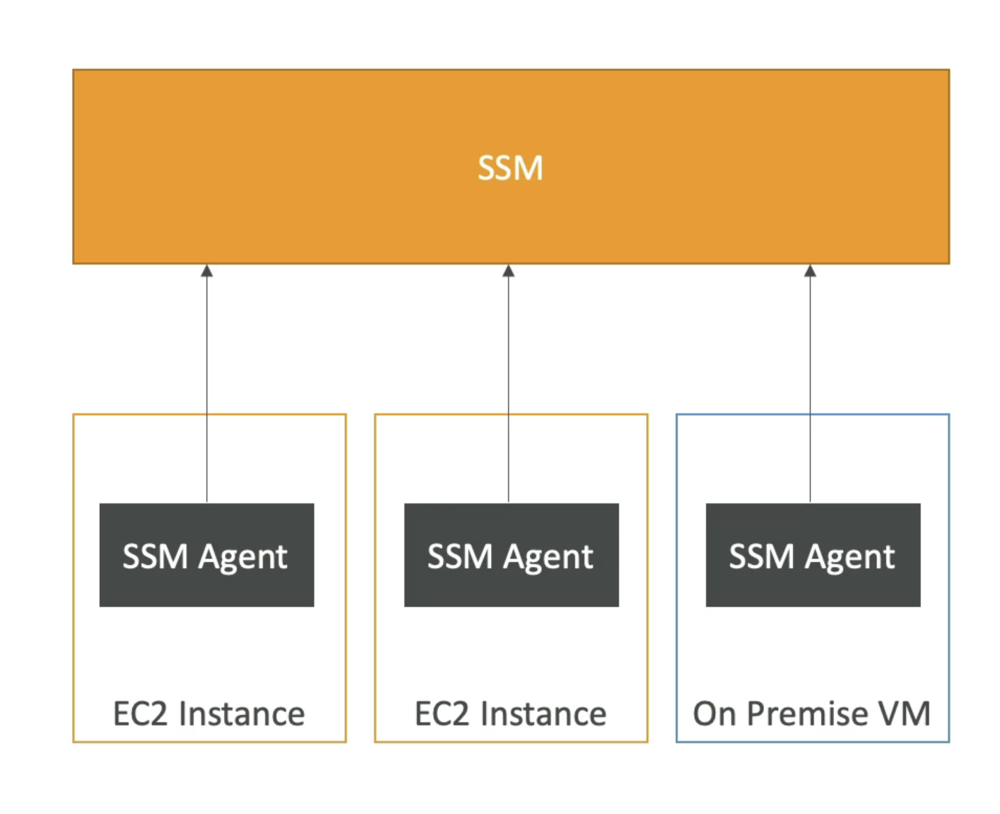

# SSM
- Helps you manage your EC2 and On-Premises systems at scale
- Another Hybrid AWS service
- Get operational insights about the state of your infrastructure
- Suite of 10+ products
- Most important features are:
    - Patching automation for enhanced compliance
    - Run commands across an entire fleet of servers
    - Store parameter configuration with the SSM Parameter Store
- Works for Linux, Windows, MacOS, and Raspberry Pi OS (Raspbian)

# How it works

- We need to install the SSM agent onto the systems we control
- Installed by default on Amazon Linux AMl & some Ubuntu AMI
- If an instance can't be controlled with SSM, it's. probably an issue with the SSM agent.
- Thanks to the SSM agent, we can run commands, patch & configure our servers

# SSM session manager

- Allows you to start a secure shell on your EC2 and on-premises servers
- No SSH access, bastion hosts, or SSH keys needed
- No port 22 needed (better security)
- Supports Linux, macOS, and Windows
- Send session log data to S3 or CloudWatch Logs

# Systems Manager Parameter Store

- Secure storage for configuration and secrets
- API Keys, passwords, configurations...
- Serverless, scalable, durable, easy SDK
- Control access permissions using IAM
- Version tracking & encryption (optional)