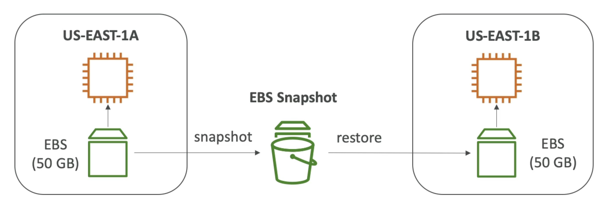

# Introduction to EBS
- An EBS (Elastic Block Store) Volume is a network drive you can attach to your instances while they run
- It allows your instances to persist data, even after their termination
- They can only be mounted to one instance at a time (at the CCP level)
- They are bound to a specific availability zone
- Analogy:Think of them as a "network USB stick"
- Free tier: 30 GB of free EBS storage of type General Purpose (SSD) or Magnetic per month

# EBS Snapshots
- Make a backup (snapshot) of your EBS volume at a point in time
- Not necessary to detach volume to do snapshot, but recommended
- Can copy snapshots across AZ or regions

## EBS Snapshot Archive
- Move a Snapshot to an "archive tier" that is 75% cheaper
- Takes within 24 to 72 hours for restoring the archive
## Recycle Bin for EBS Snapshots
- Setup rules to retain deleted snapshots so you can recover them after an accidental deletion
- Specify retention (from | day to | year)
