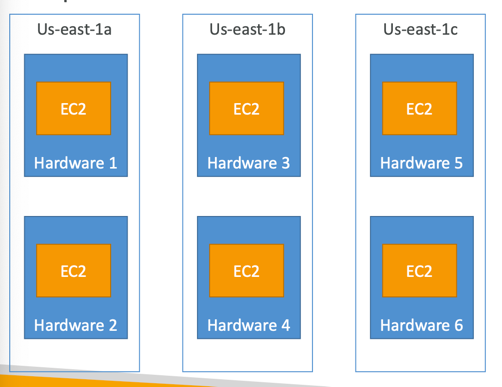
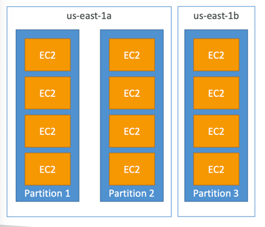

# EC2 (Elastic Compute Cloud)

## Key Capabilities
- **Rent Virtual Machines** (EC2)
- **Store Data on Virtual Drives** (EBS)
- **Distribute Load Across Machines** (ELB)
- **Scale Services Using Auto-Scaling Groups** (ASG)

---

## EC2 Sizing and Configuration Options
- **Operating System (OS):** Linux, Windows, or macOS
- **Compute Power & Cores (CPU):** Customizable to suit workload needs
- **Memory (RAM):** Configurable for different application requirements
- **Storage:**
- Network-attached (EBS, EFS)
- Local hardware (EC2 Instance Store)
- **Network Card:** Speed, Public IP address options
- **Firewall Rules:** Configured via Security Groups
- **Bootstrap Scripts:** Configure instances at launch using EC2 User Data

---

## EC2 User Data
- Automates instance initialization through **bootstrap scripts**.
- **Executed once** during the first instance launch.
- Common tasks:
- Installing updates or software
- Downloading files
- Configuring the environment
- Runs with **root user permissions**.

---

## EC2 Instance Types
### Naming Convention Example
`m5.2xlarge`
- **m:** Instance class
- **5:** Generation
- **2xlarge:** Size within the instance class

### General Purpose
- Balanced workloads (e.g., web servers, repositories)
- Equal distribution across **compute**, **memory**, and **networking**.
- Example: `t2.micro` (commonly used in tutorials).

### Compute Optimized
- High-performance processors for compute-intensive tasks:
- Batch processing
- Media transcoding
- Scientific modeling and ML
- Gaming servers

### Memory Optimized
- Ideal for processing **large data sets in memory**:
- High-performance databases
- Real-time big data analytics
- In-memory databases

### Storage Optimized
- Designed for storage-heavy tasks with high **read/write access**:
- Online transaction processing (OLTP)
- Data warehousing
- Distributed file systems

---

## Security Groups
- Core of **network security** in AWS.
- Acts as a firewall, controlling:
- **Inbound traffic:** From external sources to instances
- **Outbound traffic:** From instances to external sources
- Features:
- **Allow-only rules** (no deny rules)
- Specify IP ranges (IPv4/IPv6) or reference other Security Groups

### Common Ports
- **22:** SSH (Secure Shell) - Linux login
- **21:** FTP - File upload
- **22:** SFTP - Secure file upload
- **80:** HTTP - Unsecured web traffic
- **443:** HTTPS - Secured web traffic
- **3389:** RDP (Remote Desktop Protocol) - Windows login

---
# Placement Group
Placement Groups
- Sometimes you want control over the EC2 Instance placement strategy
- That strategy can be defined using placement groups
- When you create a placement group, you specify one of the following
## strategies for the group:
### Cluster—clusters instances into a low-latency group in a single Availability Zone
Networking enabled - recommended)

- Cons: If the AZ fails, all instances fails at the same time
- Use case:
- Big Data job that needs to complete fast
- Application that needs extremely low latency and high network throughput
## Spread—spreads instances across underlying hardware (max 7 instances per group per AZ)

- Pros:
- Can span across Availability Zones (AZ)
- Reduced risk is simultaneous failure
- EC2 Instances are on different physical hardware
- Cons:
- Limited to 7 instances per AZ per placement group
- Use case:
- Application that needs to maximize high availability
- Critical Applications where each instance must be isolated from failure from each other
## Partition—spreads instances across many different partitions (which rely on different sets of racks) within an AZ. Scales to 100s of EC2 instances per group(Hadoop, Cassandra, Kafka)

- Up to 7 partitions per AZ
- Can span across multiple AZs in the same region
- Up to 100s of EC2 instances
- The instances in a partition do not share racks with the instances in the other partitions
- A partition failure can affect many EC2 but won’t affect other partitions
- EC2 instances get access to the partition information as metadata
- Use cases: HDFS, HBase, Cassandra, Kafka
---

## EC2 Instance Purchase Options

### On-Demand Instances
- **Flexible** and predictable, billed by second (Linux/Windows).
- High cost, no upfront payment, no long-term commitment.
- Ideal for:
- Short-term, **unpredictable workloads**.
- Applications requiring flexibility.

### Reserved Instances (1 & 3 Years)
- Up to **72% discount** vs. On-Demand.
- Options:
- **Standard:** Fixed instance attributes.
- **Convertible:** Flexibility to change instance types and configurations.
- Ideal for **steady-state usage** (e.g., databases).

### Savings Plans
- Commitment to specific **hourly usage** for 1 or 3 years.
- Discounts up to **72%**, similar to Reserved Instances.
- Flexible across instance sizes, OS, and tenancy.

### Spot Instances
- **Cost-efficient:** Up to **90% discount** vs. On-Demand.
- Instances can be terminated when spot price exceeds bid price.
- Suitable for:
- **Batch jobs**
- **Data analysis**
- Non-critical or flexible workloads

### Dedicated Hosts
- Physical server dedicated to your use.
- Meets compliance or licensing needs (e.g., BYOL).
- Most expensive option.
- Use cases:
- Software with complex licensing models
- Regulatory requirements

### Dedicated Instances
- Instances run on hardware **exclusive** to you.
- No control over instance placement.
- May share hardware with other instances in your account.

### Capacity Reservations
- Reserve **capacity in a specific AZ**.
- Pay On-Demand rates, regardless of usage.
- No long-term commitment; cancel anytime.

#### Purchase Option Summary
| Option               | Discount  | Commitment | Best For                            |
|----------------------|-----------|------------|-------------------------------------|
| On-Demand            | None      | None       | Short-term, unpredictable workloads |
| Reserved             | Up to 72% | 1-3 years  | Steady-state applications           |
| Savings Plans        | Up to 72% | 1-3 years  | Flexible long-term usage            |
| Spot                 | Up to 90% | None       | Cost-sensitive, flexible workloads  |
| Dedicated Hosts      | None      | Optional   | Compliance or BYOL requirements     |
| Capacity Reservation | None      | None       | Reserved capacity in a specific AZ  |

---

## Shared Responsibility Model
### AWS Responsibilities:
- Infrastructure security (e.g., global networks, physical hosts).
- Hardware maintenance and compliance validation.

### User Responsibilities:
- Configure **Security Groups**.
- Apply OS patches and updates.
- Manage **IAM Roles** and user permissions.
- Secure data on EC2 instances.

### Shared Responsibility Storage
### AWS Responsibilities:
- Infrastructure
- Replication for data for EBS volumes & EFS drives
- Replacing faulty hardware
- Ensuring their employees cannot access your data
### User Responsibilities:
- Setting up backup / snapshot procedures
- Setting up data encryption
- Responsibility of any data on the drives
- Understanding the risk of using EC2 Instance Store

---

## Summary
### EC2 Components:
- **Users manage:** Instance type, configuration, and security.
- **AWS manages:** Infrastructure, host isolation, and compliance.

### EC2 Storage:
EBS volumes:
- network drives attached to one EC2 instance at a time
- Mapped to an Availability Zones
- Can use EBS Snapshots for backups / transferring EBS volumes across AZ
- AMI: create ready-to-use EC2 instances with our customizations
- EC2 Image Builder: automatically build, test and distribute AMls
- EC2 Instance Store:
High performance hardware disk attached to our EC2 instance
- Lost if our instance is stopped / terminated
- EFS: network file system, can be attached to 100s of instances in a region
- EFS-IA: cost-optimized storage class for infrequent accessed files
- FSx for Windows: Network File System for Windows servers
- FSx for Lustre: High Performance Computing Linux file

### Key Features:
- **Instance Variety:** Optimized for compute, memory, or storage.
- **Purchase Options:** Tailored for cost and workload requirements.
- **Security:** Control traffic with Security Groups and shared responsibility for instance security.

By understanding and optimizing EC2 capabilities, users can build scalable, cost-effective, and secure solutions in AWS.

