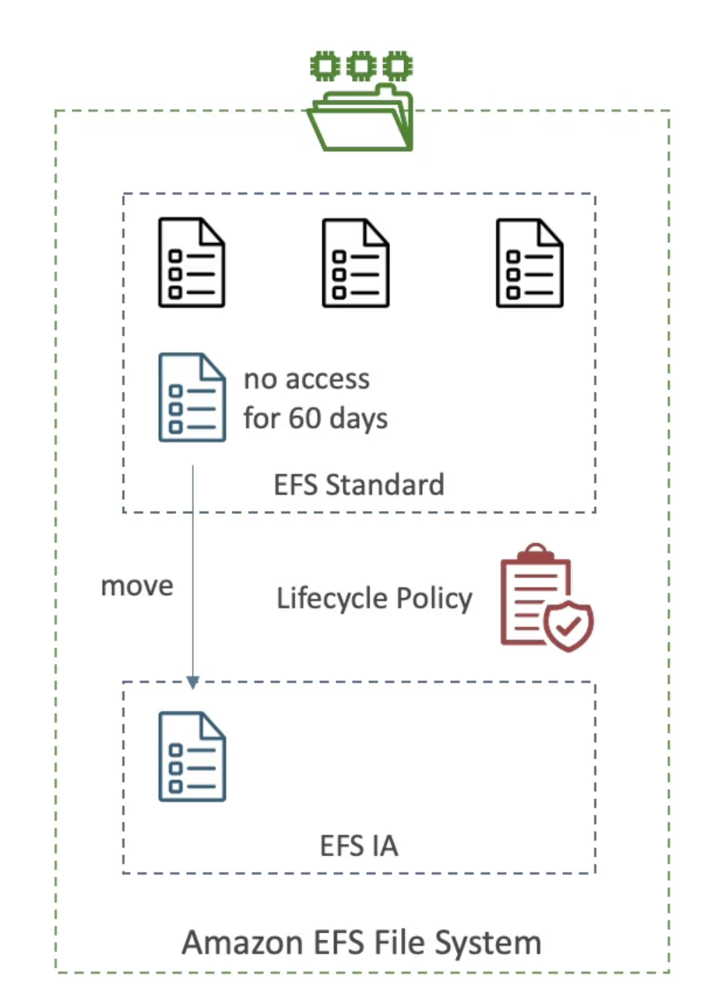

- Managed NFS (network file system) that can be mounted on 100s of EC2
- EFS works with Linux EC2 instances in multi-AZ
- Highly available, scalable, expensive (3x gp2), pay per use, no capacity planning

## EFS vs EBS

## EFS-IA(Infrequent access)
- Storage class that is cost-optimized for files not accessed every day
- Up to 92% lower cost compared to EFS Standard
- EFS will automatically move your files to EFS-IA based on the last time they were accessed
- Enable EFS-IA with a Lifecycle Policy
- Example: move files that are not accessed for 60 days to EFS-IA
- Transparent to the applications accessing EFS
