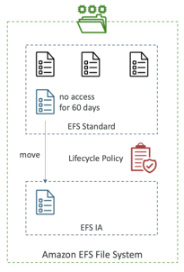

# EFS (Elastic File System)
- Managed NFS (network file system) that can be mounted on 100s of EC2
- EFS works with Linux EC2 instances in multi-AZ
- Highly available, scalable, expensive (3x gp2), pay per use, no capacity planning
- Use cases: content management, web serving, data sharing, Wordpress
- Uses NFSv4.1 protocol
- Uses security group to control access to EFS
- Compatible with Linux based AMI (not Windows)
- Encryption at rest using KMS
- POSIX file system (~Linux) that has a standard file API
- File system scales automatically, pay-per-use, no capacity planning!

## EFS Performance classes
### EFS Scale
- 1000s of concurrent NFS clients, 10 GB+ /s throughput
- Grow to Petabyte-scale network file system, automatically
### Performance Mode (set at EFS creation time)
- General Purpose (default) – latency-sensitive use cases (web server, CMS, etc…)
- Max I/O – higher latency, throughput, highly parallel (big data, media processing)
### Throughput Mode
- Bursting – 1 TB = 50MiB/s + burst of up to 100MiB/s
- Provisioned – set your throughput regardless of storage size, ex: 1 GiB/s for 1 TB storage
- Elastic – automatically scales throughput up or down based on your workloads
- Up to 3GiB/s for reads and 1GiB/s for writes
- Used for unpredictable workloads

## EFS Storage classes
### Storage Tiers (lifecycle management feature – move file after N days)

- Standard: for frequently accessed files
- Infrequent access (EFS-IA): cost to retrieve files, lower price to store.
- Archive: rarely accessed data (few times each year), 50% cheaper
- Implement lifecycle policies to move files between storage tiers
### Availability and durability
- Standard: Multi-AZ, great for prod
- One Zone: One AZ, great for dev, backup enabled by

### EFS-IA(Infrequent access)
- Storage class that is cost-optimized for files not accessed every day
- Up to 92% lower cost compared to EFS Standard
- EFS will automatically move your files to EFS-IA based on the last time they were accessed
- Enable EFS-IA with a Lifecycle Policy
- Example: move files that are not accessed for 60 days to EFS-IA
- Transparent to the applications accessing EFS

## EFS vs EBS
