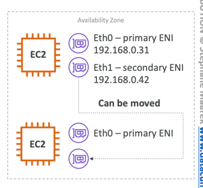
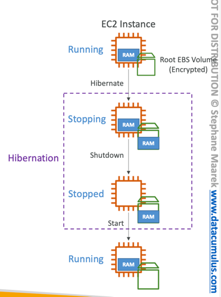

# Private vs Public IP ((Pv4) Fundamental Differences
- Public IP:
- Public IP means the machine can be identified on the internet (WWW)
- Must be unique across the whole web (not two machines can have the same public IP).
- Can be geo-located easily
- Private IP:
- Private IP means the machine can only be identified on a private network only
- The IP must be unique across the private network
- BUT two different private networks (two companies) can have the same IPs.
- Machines connect to WWW using a NAT + internet gateway (a proxy)
# Elastic IP
- With an Elastic IP address, you can mask the failure of an instance or software by rapidly remapping the address to another instance in your account.
- You can only have 5 Elastic IP in your account (you can ask AWS to increase that).
- Overall, try to avoid using Elastic IP:
- They often reflect poor architectural decisions
- Instead, use a random public IP and register a DNS name to it.
- Or, as we'll see later, use a Load Balancer and don't use a public IP

# Private vs Public IP ((Pv4) In AWS EC2 - Hands On
- By default, your EC2 machine comes with:
- A private IP for the internal AWS Network
- A public IP, for the WWW.
- When we are doing SSH into our EC2 machines:
- We can't use a private IP, because we are not in the same network
- We can only use the public IP.
- If your machine is stopped and then started, the public IP can change

---
# ENI (Elastic Network Interface)

- Logical component in a VPC that represents a virtual network card
- The ENI can have the following attributes:
    - Primary private IPv4, one or more secondary IPv4
    - One Elastic IP (IPv4) per private IPv4
    - One Public IPv4
    - One or more security groups
    - A MAC address
- You can create ENI independently and attach them on the fly (move them) on EC2 instances for failover
- Bound to a specific availability zone (AZ)

# EC2 Hibernate

- Introducing EC2 Hibernate:
- The in-memory (RAM) state is preserved
- The instance boot is much faster!
(the OS is not stopped / restarted)
- Under the hood: the RAM state is written
to a file in the root EBS volume
- The root EBS volume must be encrypted
- Use cases:
- Long-running processing
- Saving the RAM state
- Services that take time to initialize
## EC2 Hibernate - Good to Know
- Supported Instance Families – C3, C4, C5, I3, M3, M4, R3, R4, T2, T3, …
- Instance RAM Size – must be less than 150 GB.
- Instance Size – not supported for bare metal instances.
- AMI – Amazon Linux 2, Linux AMI, Ubuntu, RHEL, CentOS & Windows…
- Root Volume – must be EBS, encrypted, not instance store, and large
- Available for On-Demand, Reserved and Spot Instances
- An instance can NOT be hibernated more than 60 days

