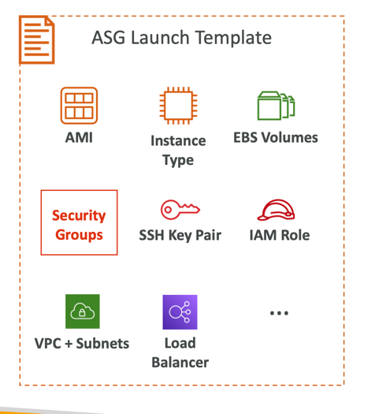
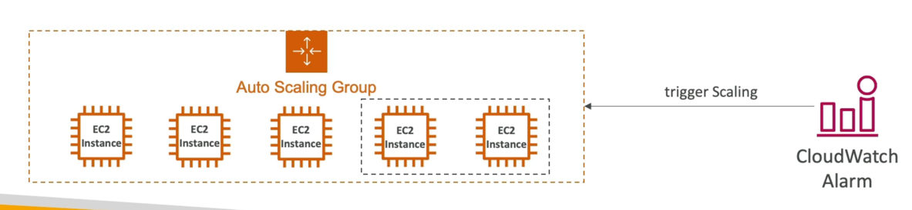
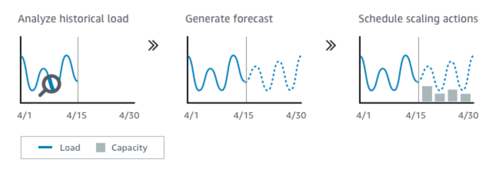

# Introduction to Auto Scaling Group (ASG)

- In real-life, the load on your websites and application can change
- In the cloud, you can create and get rid of servers very quickly
- The goal of an Auto Scaling Group (ASG) is to:
- Scale out (add EC2 instances) to match an increased load
- Scale in (remove EC2 instances) to match a decreased load
- Ensure we have a minimum and a maximum number of machines running
- Automatically register new instances to a load balancer
- Replace unhealthy instances
- Cost Savings: only run at an optimal capacity (principle of the cloud)

## Auto Scaling Group Attributes
## A Launch Template (older “Launch Configurations” are deprecated)

- AMI + Instance Type
- EC2 User Data
- EBS Volumes
- Security Groups
- SSH Key Pair
- IAM Roles for your EC2 Instances
- Network + Subnets Information
- Load Balancer Information
- Min Size / Max Size / Initial Capacity
- Scaling Policies

# Scaling Strategies
- It is possible to scale an ASG based on CloudWatch alarms
- An alarm monitors a metric (such as Average CPU, or a custom metric)
- Metrics such as Average CPU are computed for the overall ASG instances
- Based on the alarm:
    - We can create scale-out policies (increase the number of instances)
    - We can create scale-in policies (decrease the number of instances)

## Auto Scaling Groups - Scaling Strategies
- Manual Scaling: Update the size of an ASG manually
## Dynamic Scaling: Respond to changing demand
### Simple Step Scaling
- When a CloudWatch alarm is triggered (example CPU > 70%), then add 2 units
- When a CloudWatch alarm is triggered (example CPU < 30%), then remove I
### Target Tracking Scaling
- Simple to set up
- Example: I want the average ASG CPU to stay at around 40%
## Scheduled Scaling
- Anticipate a scaling based on known usage patterns
- Example: increase the min. capacity to 10 at 5 pm on Fridays
## Predictive Scaling
- Uses Machine Learning to predict future traffic ahead of time
- Automatically provisions the right number of EC2 instances in advance

# Good metrics to scale on
- CPUUtilization: Average CPU utilization across your instances
- RequestCountPerTarget: to make sure the number of requests per EC2 instances is stable
- Average Network In / Out (if you’re application is network bound)
- Any custom metric (that you push using CloudWatch)
# ASG - Scaling Cooldowns
- After a scaling activity happens, you are in the cooldown period (default 300 seconds)
- During the cooldown period, the ASG will not launch or terminate additional instances (to allow for metrics to stabilize)
- Advice: Use a ready-to-use AMI to reduce configuration time in order to be serving request faster and reduce the cooldown period
# ELB & ASG - Summary
- High Availability vs Scalability (vertical and horizontal) vs Elasticity vs Agility in the Cloud
- Elastic Load Balancers (ELB)
- Distribute traffic across backend EC2 instances, can be Multi-AZ
- Supports health checks
- 4 types: Classic (old), Application (HTTP - L7), Network (TCP - L4), Gateway (L3)
- Auto Scaling Groups (ASG)
- Implement Elasticity for your application, across multiple AZ
- Scale EC2 instances based on the demand on your system, replace unhealthy
- Integrated with the ELB