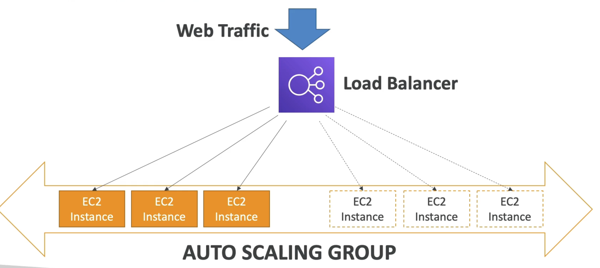

# Introduction to Auto Scaling Group (ASG)
- In real-life, the load on your websites and application can change
- In the cloud, you can create and get rid of servers very quickly
- The goal of an Auto Scaling Group (ASG) is to:
- Scale out (add EC2 instances) to match an increased load
- Scale in (remove EC2 instances) to match a decreased load
- Ensure we have a minimum and a maximum number of machines running
- Automatically register new instances to a load balancer
- Replace unhealthy instances
- Cost Savings: only run at an optimal capacity (principle of the cloud)

# Scaling Strategies
## Auto Scaling Groups - Scaling Strategies
- Manual Scaling: Update the size of an ASG manually
## Dynamic Scaling: Respond to changing demand
- Simple / Step Scaling
- When a CloudWatch alarm is triggered (example CPU > 70%), then add 2 units
- When a CloudWatch alarm is triggered (example CPU < 30%), then remove I
- Target Tracking Scaling
- Example: I want the average ASG CPU to stay at around 40%
## Scheduled Scaling
- Anticipate a scaling based on known usage patterns
- Example: increase the min. capacity to 10 at 5 pm on Fridays
## Predictive Scaling
- Uses Machine Learning to predict future traffic ahead of time
- Automatically
provisions the right number of EC2
instances in advance
# ELB & ASG - Summary
- High Availability vs Scalability (vertical and horizontal) vs Elasticity vs Agility in the Cloud
- Elastic Load Balancers (ELB)
- Distribute traffic across backend EC2 instances, can be Multi-AZ
- Supports health checks
- 4 types: Classic (old), Application (HTTP - L7), Network (TCP - L4), Gateway (L3)
- Auto Scaling Groups (ASG)
- Implement Elasticity for your application, across multiple AZ
- Scale EC2 instances based on the demand on your system, replace unhealthy
- Integrated with the ELB