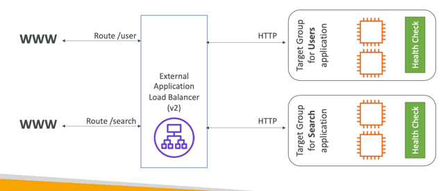
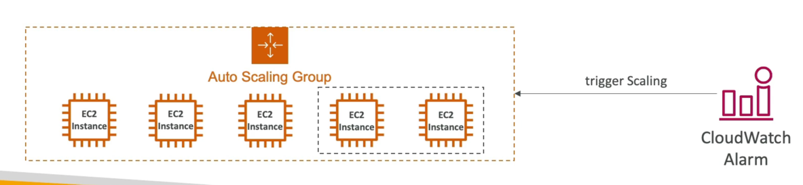

# Introduction to Elastic Load Balancer

- Spread load across multiple downstream instances
- Expose a single point of access (DNS) to your application
- Seamlessly handle failures of downstream instances
- Do regular health checks to your instances
- Provide SSL termination (HTTPS) for your websites
- High availability across zones
- An ELB (Elastic Load Balancer) is a managed load balancer
- AWS guarantees that it will be working
- AWS takes care of upgrades, maintenance, high availability
- AWS provides only a few configuration knobs
- It costs less to setup your own load balancer but it will be a lot more effort on your end (maintenance, integrations)

# Why use an ELB?
- Spread load across multiple downstream instances
- Expose a single point of access (DNS) to your application
- Seamlessly handle failures of downstream instances
- Do regular health checks to your instances
- Provide SSL termination (HTTPS) for your websites
- Enforce stickiness with cookies
- High availability across zones
- Separate public traffic from private traffic

## Health Checks
- Health Checks are crucial for Load Balancers
- They enable the load balancer to know if instances it forwards traffic to are available to reply to requests
- The health check is done on a port and a route (/health is common)
- If the response is not 200 (OK), then the instance is unhealthy

# 4 kinds of load balancers offered by AWS:
- Classic Load Balancer (v| - old generation) - 2009 - CLB
    -НТТР, HTTPS, TCP, SSL (secure TCP)
- Application Load Balancer (v2 - new generation) - 2016 - ALB
    - НТТР, HTTPS, WebSocket
- Network Load Balancer (v2 - new generation) - 2017 - NLB
    - TCP, TLS (secure TCP), UDP
- Gateway Load Balancer - 2020 - GWLB
    - Operates at layer 3 (Network layer) - IP Protocol

## Security Groups

# Application Load Balancer (ALB)
- Application load balancers is Layer 7 (HTTP)
- Load balancing to multiple HTTP applications across machines
(target groups)
- Load balancing to multiple applications on the same machine
(ex: containers)
- Support for HTTP/2 and WebSocket
- Support redirects (from HTTP to HTTPS for example)
- Routing tables to different target groups:
- Routing based on path in URL (example.com/users & example.com/posts)
- Routing based on hostname in URL (one.example.com & other.example.com)
- Routing based on Query String, Headers
(example.com/users?id=123&order=false)
- ALB are a great fit for micro services & container-based application
(example: Docker & Amazon ECS)
- Has a port mapping feature to redirect to a dynamic port in ECS
- In comparison, we’d need multiple Classic Load Balancer per application

## Target Groups

- EC2 instances (can be managed by an Auto Scaling Group) – HTTP
- ECS tasks (managed by ECS itself) – HTTP
- Lambda functions – HTTP request is translated into a JSON event
- IP Addresses – must be private IPs
- ALB can route to multiple target groups
- Health checks are at the target group level
## Good to know
- Fixed hostname (XXX.region.elb.amazonaws.com)
- The application servers don’t see the IP of the client directly
- The true IP of the client is inserted in the header X-Forwarded-For
- We can also get Port (X-Forwarded-Port) and proto (X-Forwarded-Proto)

# Network Load Balancer (NLB)
- Network load balancers (Layer 4) allow to:
    - Forward TCP & UDP traffic to your instances
    - Handle millions of request per seconds
    - Ultra-low latency
- NLB has one static IP per AZ, and supports assigning Elastic IP(helpful for whitelisting specific IP)
- NLB are used for extreme performance, TCP or UDP traffic
- Not included in the AWS free tier

## Target Groups
- EC2 instances
- IP Addresses – must be private IPs
- Application Load Balancer
- Health Checks support the TCP, HTTP and HTTPS Protocols

# Gateway Load Balancer (GWLB)
- Deploy, scale, and manage a fleet of 3rd party network virtual appliances in AWS
- Operates at Layer 3 (Network Layer) – IP Packets
- Combines the following functions:
    - Transparent Network Gateway – single entry/exit for all traffic
    - Load Balancer – distributes traffic to your virtual appliances
- Uses the GENEVE protocol on port 6081

## Target Groups
- EC2 instances
- IP Addresses – must be private IPs

# Sticky Sessions (Session Affinity)
- It is possible to implement stickiness so that the  same client is always redirected to the same instance behind a load balancer
- This works for Classic Load Balancer, Application Load Balancer, and Network Load Balancer
- For both CLB & ALB, the “cookie” used for stickiness has an expiration date you control
- Use case: make sure the user doesn’t lose his session data
- Enabling stickiness may bring imbalance to the load over the backend EC2 instances

## Cookie Names
- Application-based Cookies
    - Custom cookie
        - Generated by the target
        - Can include any custom attributes required by the application
        - Cookie name must be specified individually for each target group
        - Don’t use AWSALB, AWSALBAPP, or AWSALBTG (reserved for use by the ELB)
    - Application cookie
        - Generated by the load balancer
        - Cookie name is AWSALBAPP
- Duration-based Cookies
    - Cookie generated by the load balancer
    - Cookie name is AWSALB for ALB, AWSELB for CLB

# Cross-Zone Load Balancing

- Application Load Balancer
    - Enabled by default (can be disabled at the Target Group level)
    - No charges for inter AZ data
- Network Load Balancer & Gateway Load Balancer
    - Disabled by default
    - You pay charges ($) for inter AZ data if enabled
- Classic Load Balancer
    - Disabled by default
    - No charges for inter AZ data if enabled

# SSL/TLS
## Basics
- An SSL certificate allows traffic between your clients and your load balancer o be encrypted in transit (in-flight encryption)
- SSL refers to Secure Sockets Layer, used to encrypt connections 
- TLS refers to Transport Layer Security, which is a newer version
- Nowadays, TLS certificates are mainly used, but people still refer as SSL
- Public SSL certificates are issued by Certificate Authorities (CA)
- Comodo, Symantec, GoDaddy, GlobalSign, Digicert, Letsencrypt, etc…
- SSL certificates have an expiration date (you set) and must be renewed
## Load balancer - SSL Certificates

- The load balancer uses an X.509 certificate (SSL/TLS server certificate)
- You can manage certificates using ACM (AWS Certificate Manager)
- You can create upload your own certificates alternatively
- HTTPS listener:
    - You must specify a default certificate
    - You can add an optional list of certs to support multiple domains
    - Clients can use SNI (Server Name Indication) to specify the hostname they reach
    - Ability to specify a security policy to support older versions of SSL / TLS (legacy clients)

## SSL - Server Name Indication (SNI)
- SNI solves the problem of loading multiple SSL certificates onto one web server (to serve multiple websites)
- It’s a “newer” protocol, and requires the client to indicate the hostname of the target server in the initial SSL handshake
- The server will then find the correct certificate, or return the default one
Note:
- Only works for ALB & NLB (newer generation), CloudFront
- Does not work for CLB (older gen)

## ELB - SSL Certificates
- Classic Load Balancer (v1)
    - Support only one SSL certificate
    - Must use multiple CLB for multiple hostname with multiple SSL certificates
- Application Load Balancer (v2)
    - Supports multiple listeners with multiple SSL certificates
    - Uses Server Name Indication (SNI) to make it work
- Network Load Balancer (v2)
    - Supports multiple listeners with multiple SSL certificates
    - Uses Server Name Indication (SNI) to make it work

## Connection Draining

- Feature naming
    - Connection Draining – for CLB
    - Deregistration Delay – for ALB & NLB
- Time to complete “in-flight requests” while the instance is de-registering or unhealthy
- Stops sending new requests to the EC2 instance which is de-registering
- Between 1 to 3600 seconds (default: 300 seconds)
- Can be disabled (set value to 0)
- Set to a low value if your requests are short

