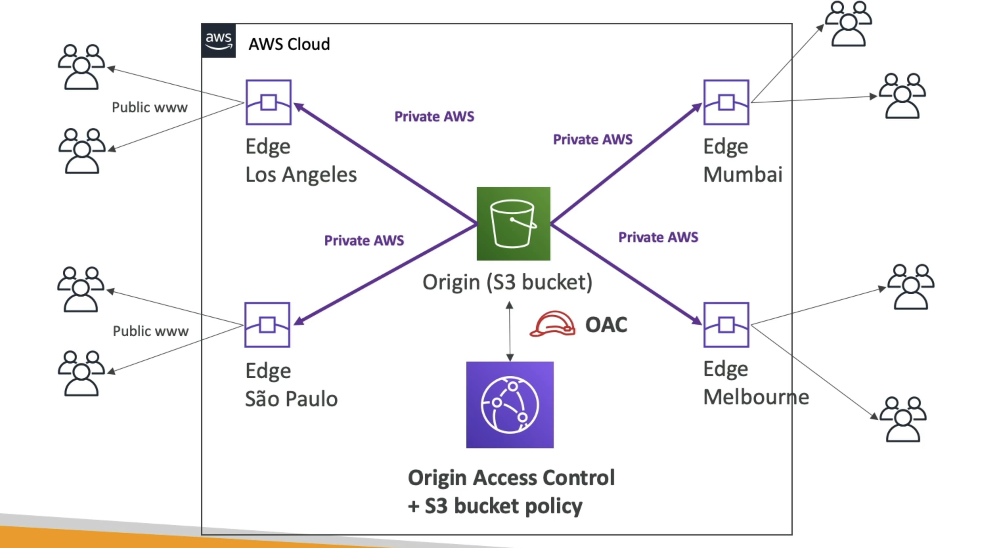
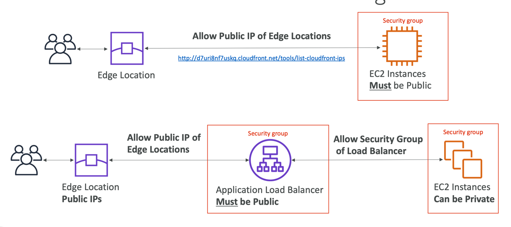
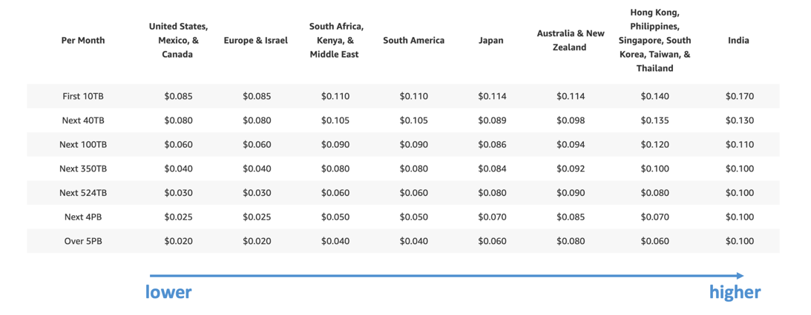

# CloudFront Overview
- Content Delivery Network (CDN)
- Improves read performance, content is cached at the edge
- Improves users experience
- 216 Point of Presence globally (edge locations)
- DDoS protection (because worldwide), integration with Shield, AWS Web Application Firewall

# Origins
## S3 bucket
- For distributing files and caching them at the edge
- Enhanced security with CloudFront Origin Access Control (OAC)
- OAC is replacing Origin Access Identity (OAl)
- CloudFront can be used as an ingress (to upload files to S3)
## Custom Origin (HTTP)
- Application Load Balancer
- EC2 instance
- S3 website (must first enable the bucket as a static S3 website)
- Any HTTP backend you want

# Cloudfront at a high level

- Example:

# Cloudfront vs. S3 Cross Region Replication
## CloudFront:
- Global Edge network
- Files are cached for a TTL (maybe a day)
- Great for static content that must be available everywhere
## S3 Cross Region Replication:
- Must be setup for each region you want replication to happen
- Files are updated in near real-time
- Read only
- Great for dynamic content that needs to be available at low-latency in few
## ALB or EC2 as an origin

## CloudFront Geo Restriction
- You can restrict who can access your distribution
- Allowlist: Allow your users to access your content only if they're in one of the countries on a list of approved countries.
- Blocklist: Prevent your users from accessing your content if they're in one of the countries on a list of banned countries.
- The “country” is determined using a 3rd party Geo-IP database
- Use case: Copyright Laws to control access to content

## CloudFront - Pricing
- CloudFront Edge locations are all around the world
- The cost of data out per edge location varies

## Cache Invalidations
- In case you update the back-end origin, CloudFront doesn’t know about it and will only get the refreshed content after the TTL has expired
- However, you can force an entire or partial cache refresh (thus bypassing the TTL) by performing a CloudFront Invalidation
- You can invalidate all files (*) or a special path (/images/*)
