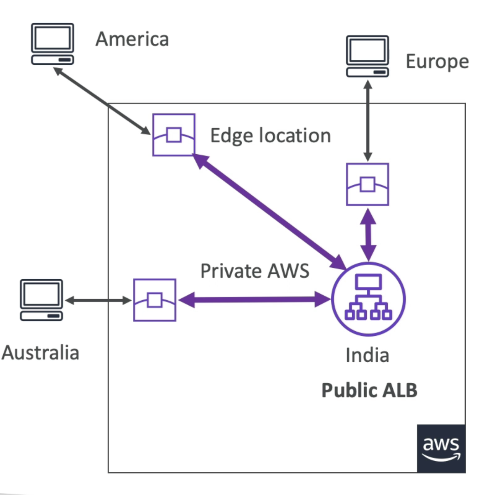
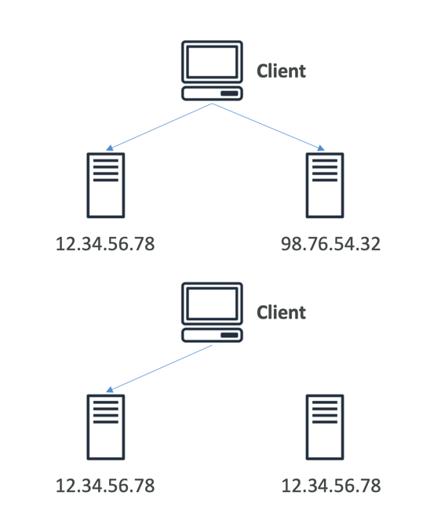
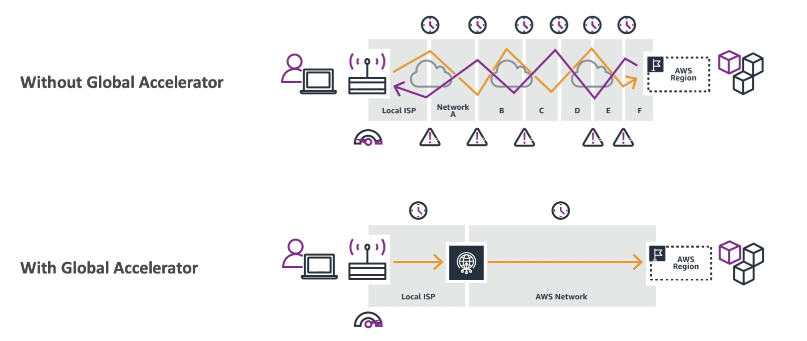

# Global Accelerator

- Improve global application availability and performance using the AWS global network
- Leverage the AWS internal network to optimize the route to your application (60% improvement)
- 2 Anycast IP are created for your application and traffic is sent through Edge Locations
- The Edge locations send the traffic to your application
- Works with Elastic IP, EC2 instances, ALB, NLB, public or private
- Consistent Performance
  - Intelligent routing to lowest latency and fast regional failover
  - No issue with client cache (because the IP doesn’t change)
  - Internal AWS network
- Health Checks
  - Global Accelerator performs a health check of your applications
  - Helps make your application global (failover less than 1 minute for unhealthy)
  - Great for disaster recovery (thanks to the health checks)
- Security
  - only 2 external IP need to be whitelisted
  - DDoS protection thanks to AWS Shield

## Unicast IP vs Anycast IP

- Unicast IP: one server holds one IP address
- Anycast IP: all servers hold the same IP address and the client is routed to the nearest one

# Diagram

# Global Accelerator vs. CloudFront
- They both use the AWS global network and its edge locations around the world
- Both services integrate with AWS Shield for DDoS protection.
- CloudFront
  - Improves performance for both cacheable content (such as images and videos)
  - Dynamic content (such as API acceleration and dynamic site delivery)
  - Content is served at the edge
- Global Accelerator
  - Improves performance for a wide range of applications over TCP or UDP
  - Proxying packets at the edge to applications running in one or more AWS Regions.
  - Good fit for non-HTTP use cases, such as gaming (UDP), IoT (MQTT), or Voice over IP
  - Good for HTTP use cases that require static IP addresses
  - Good for HTTP use cases that required deterministic, fast regional failover